# Fitting đường thẳng và đường tròn: Least Squares, Taubin, Trimmed, RANSAC

Trong đo lường bằng thị giác máy (đo đường kính lỗ, vị trí tâm, độ thẳng của cạnh, khoảng cách giữa hai cạnh...), bước cuối cùng hầu như luôn là: **có một tập điểm biên, hãy tìm đường thẳng hoặc đường tròn khớp nhất với chúng**. Bài này đi sâu vào bốn nhóm thuật toán hay dùng nhất cho bước đó:

| Nhóm | Đường thẳng | Đường tròn | Chống ngoại lai? |
|---|---|---|---|
| Bình phương tối thiểu (Least Squares) | thông thường `y = a·x + b`, Total Least Squares | Kasa (đại số), fit hình học | Không |
| Taubin | (không áp dụng) | Taubin | Không |
| Trimmed (cắt tỉa lặp) | Total Least Squares + cắt tỉa | Taubin / Kasa + cắt tỉa | Có, với ngoại lai cục bộ |
| RANSAC (Random Sample Consensus) | mẫu 2 điểm | mẫu 3 điểm + cổng bán kính | Có, kể cả ngoại lai dạng cụm |
| Tukey (tái trọng số lặp) | Total Least Squares có trọng số | Taubin có trọng số | Có, cần điểm khởi tạo tốt |

Với mỗi thuật toán, bài viết trình bày: **ý tưởng → toán học → code → ảnh debug → khi nào dùng, khi nào hỏng**. Mọi con số và hình ảnh trong bài đều được sinh lại được bằng code đi kèm:

- [`circle_line_fitting/fitting.py`](circle_line_fitting/fitting.py): thư viện, chỉ cần `numpy`.
- [`circle_line_fitting/make_figures.py`](circle_line_fitting/make_figures.py): sinh toàn bộ hình trong bài (cần thêm `matplotlib`, `opencv-python`).

```bash
cd docs/image_processing/circle_line_fitting
python make_figures.py       # ghi ảnh vào ./images/, in các bảng số ra màn hình
```

---

## 0. Bối cảnh: từ ảnh đến tập điểm { #boi-canh }

Trước khi fit, ta cần các **điểm biên**. Cách phổ biến trong đo lường là dùng *caliper*: đặt các đoạn thẳng ngắn cắt ngang biên dự kiến, lấy mẫu cường độ sáng dọc từng đoạn, tìm vị trí gradient lớn nhất và nội suy parabol để có vị trí biên chính xác dưới mức pixel. Với đường tròn, các caliper được xếp **xuyên tâm** quanh một ước lượng thô (ví dụ từ biến đổi Hough).

<figure markdown>
  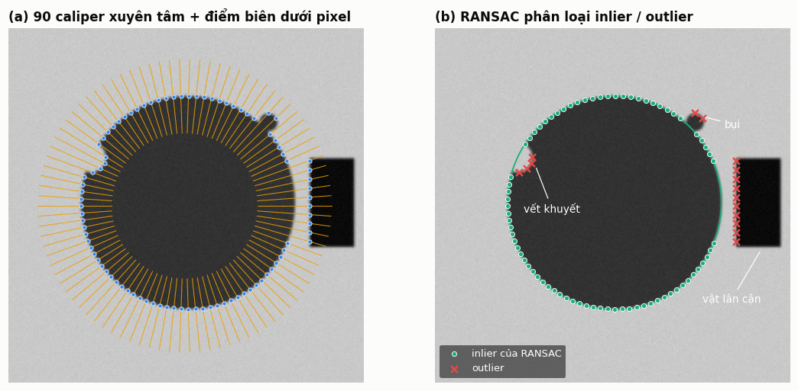
  <figcaption>Hình 1. Ảnh tổng hợp: lỗ tối trên nền sáng, có một vết khuyết, một hạt bụi và một vật lân cận tối hơn. (a) 90 caliper xuyên tâm (màu vàng) và điểm biên tìm được. (b) Điểm bị vết khuyết, bụi và vật lân cận "bắt nhầm" trở thành ngoại lai.</figcaption>
</figure>

Hình 1 cho thấy ngay vấn đề cốt lõi: **tập điểm luôn có ngoại lai**. Caliper không biết đâu là biên "đúng", nó chỉ lấy chỗ gradient mạnh nhất. Ở vùng có vật lân cận (tương phản mạnh hơn biên lỗ), cả một cụm caliper bắt vào cạnh của vật đó. Thuật toán fit phải đủ tốt để bỏ qua các điểm này; nếu không, tâm lỗ bị kéo lệch 5.8 pixel (xem [mục 4.3](#anh-tong-hop)).

---

## 1. Nền tảng chung { #nen-tang }

### 1.1 Phần dư hình học và phần dư đại số { #phan-du }

Mọi phương pháp fit đều cực tiểu hóa một hàm của **phần dư** (residual), tức "độ lệch" của từng điểm so với mô hình. Có hai cách định nghĩa:

**Phần dư hình học** là khoảng cách Euclid thật từ điểm tới đường:

- Đường thẳng qua $p_0$ với pháp tuyến đơn vị $n$: $\;d_i = (p_i - p_0)\cdot n$
- Đường tròn tâm $(a, b)$, bán kính $r$: $\;d_i = \rho_i - r,\quad \rho_i = \sqrt{(x_i-a)^2 + (y_i-b)^2}$

**Phần dư đại số** là giá trị của phương trình ẩn khi thay điểm vào:

- Đường tròn: $\;f_i = (x_i-a)^2 + (y_i-b)^2 - r^2 = \rho_i^2 - r^2$

Phần dư hình học mới là thứ ta thực sự quan tâm (đo bằng pixel, rồi đổi ra milimét). Nhưng với đường tròn, $d_i$ **phi tuyến** theo $(a, b, r)$ nên không có nghiệm đóng, phải lặp và cần điểm khởi tạo. Phần dư đại số thì **tuyến tính** theo một bộ tham số thích hợp nên giải được trong một bước. Toàn bộ câu chuyện Kasa so với Taubin ([mục 3](#duong-tron)) xoay quanh câu hỏi: *phần dư đại số xấp xỉ phần dư hình học tốt đến đâu?*

### 1.2 Hai loại ngoại lai { #hai-loai-ngoai-lai }

Dữ liệu thực có hai kiểu "bẩn" khác nhau về bản chất, và mỗi kiểu cần một loại công cụ:

| Loại | Ví dụ | Đặc điểm | Công cụ phù hợp |
|---|---|---|---|
| **Ngoại lai cục bộ** | vết khuyết, bụi, bavia, biên hơi mờ | lệch vài pixel tới vài chục pixel, rải rác, fit ban đầu vẫn "gần đúng" | Trimmed, Tukey |
| **Ngoại lai dạng cụm** | caliper bắt vào lỗ bên cạnh, cạnh của chi tiết khác | nhiều điểm cùng nằm trên **một mô hình khác**, có thể kéo fit ban đầu đi rất xa | RANSAC |

Điểm mấu chốt: Trimmed và Tukey là **phương pháp cục bộ**. Chúng bắt đầu từ một fit không bền vững rồi sửa dần. Nếu fit ban đầu đã sai quá xa, chính các điểm *tốt* trở thành "ngoại lai" trong mắt thuật toán và bị loại bỏ. RANSAC là **phương pháp toàn cục**: nó không cần điểm xuất phát. [Hình 12](#khang-ngoai-lai) minh họa rõ sự khác biệt này.

### 1.3 Công cụ toán học dùng lại nhiều lần: phân tích giá trị suy biến { #phan-tich-gia-tri-suy-bien }

Nhiều thuật toán dưới đây (Total Least Squares, Taubin) quy về cùng một bài toán:

$$
\min_{a}\; \lVert M a \rVert^2 \quad \text{với ràng buộc} \quad \lVert a \rVert = 1
$$

trong đó $M$ là ma trận $N \times k$ (mỗi hàng ứng với một điểm). Phân tích giá trị suy biến (Singular Value Decomposition) viết $M = U \Sigma V^\top$ với $\sigma_1 \ge \sigma_2 \ge \dots \ge \sigma_k \ge 0$. Khi đó:

$$
\lVert M a \rVert^2 = a^\top M^\top M a = a^\top V \Sigma^2 V^\top a
$$

Biểu thức này là trung bình có trọng số $\sigma_j^2$ của các thành phần của $a$ theo từng cột của $V$, nên nó nhỏ nhất khi $a$ trùng với **cột cuối của $V$** (ứng với $\sigma_k$ nhỏ nhất), và giá trị cực tiểu bằng $\sigma_k^2$. Trong numpy:

```python
_, s, vt = np.linalg.svd(M, full_matrices=False)
a = vt[-1]          # hàng cuối của V^T = cột cuối của V
```

Vì sao không tính trị riêng của $M^\top M$ cho nhanh? Vì việc tạo $M^\top M$ bình phương số điều kiện của ma trận: sai số làm tròn bị khuếch đại lên theo bình phương. Phân tích giá trị suy biến làm việc thẳng trên $M$ nên ổn định số hơn, trong khi chi phí với $k = 2$ hoặc $3$ là không đáng kể.

---

## 2. Đường thẳng { #duong-thang }

### 2.1 Bình phương tối thiểu thông thường: vì sao không nên dùng `y = a·x + b` { #binh-phuong-toi-thieu-thong-thuong }

Cách đầu tiên ai cũng học là hồi quy $y = a x + b$, cực tiểu hóa $\sum_i (y_i - a x_i - b)^2$. Nghiệm đóng:

$$
a = \frac{\operatorname{cov}(x, y)}{\operatorname{var}(x)}, \qquad b = \bar y - a \bar x
$$

Mô hình này giả định **chỉ $y$ có nhiễu, còn $x$ chính xác tuyệt đối**. Điều đó đúng với dữ liệu kiểu "nhiệt độ theo thời gian", nhưng sai với điểm biên trong ảnh: nhiễu có ở cả hai trục như nhau. Hậu quả:

<figure markdown>
  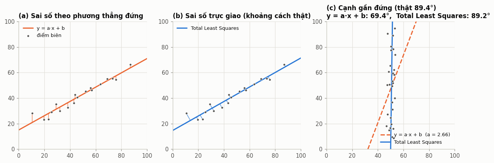
  <figcaption>Hình 2. (a) Hồi quy y theo x đo sai số theo phương thẳng đứng. (b) Total Least Squares đo khoảng cách vuông góc. (c) Với cạnh gần thẳng đứng (thật 89.4°), hồi quy y theo x cho góc 69.4°, sai 20°.</figcaption>
</figure>

Ở hình 2c, $\operatorname{var}(x)$ gần như chỉ còn là phương sai của nhiễu, nên mẫu số rất nhỏ và độ dốc bị kéo mạnh về 0 (hiện tượng *regression dilution*). Với cạnh thẳng đứng hoàn toàn, $\operatorname{var}(x) \to 0$ và công thức vỡ. Trong ảnh, một cạnh có thể nằm ở bất kỳ góc nào, nên **mọi phương pháp fit đường thẳng dưới đây đều dùng khoảng cách vuông góc**.

### 2.2 Total Least Squares (hồi quy trực giao) { #total-least-squares }

**Ý tưởng.** Tìm đường thẳng sao cho tổng bình phương *khoảng cách vuông góc* từ các điểm tới nó nhỏ nhất. Biểu diễn đường thẳng bằng một điểm $p_0$ và pháp tuyến đơn vị $n$:

$$
J(p_0, n) = \sum_{i=1}^{N} \big( (p_i - p_0)\cdot n \big)^2, \qquad \lVert n \rVert = 1
$$

**Bước 1: tìm $p_0$.** Đạo hàm theo $p_0$ và cho bằng 0:

$$
\frac{\partial J}{\partial p_0} = -2 \sum_i \big( (p_i - p_0)\cdot n \big)\, n = 0
\;\;\Rightarrow\;\; n \cdot \Big( \sum_i p_i - N p_0 \Big) = 0
$$

Trọng tâm $p_0 = \bar p = \frac{1}{N}\sum_i p_i$ thỏa mãn điều kiện này. Nói cách khác: **đường thẳng tối ưu luôn đi qua trọng tâm của các điểm**.

**Bước 2: tìm $n$.** Đặt $q_i = p_i - \bar p$ và $Q$ là ma trận $N \times 2$ có các hàng là $q_i$:

$$
J(n) = \sum_i (q_i \cdot n)^2 = \lVert Q n \rVert^2
$$

Đây đúng là bài toán ở [mục 1.3](#phan-tich-gia-tri-suy-bien). Với $Q = U \Sigma V^\top$:

- **pháp tuyến** $n$ = `vt[1]` (giá trị suy biến nhỏ nhất $\sigma_2$, hướng dữ liệu "mỏng" nhất),
- **chỉ phương** = `vt[0]` (giá trị suy biến lớn nhất $\sigma_1$, hướng dữ liệu "trải dài" nhất),
- căn quân phương của phần dư $= \sigma_2 / \sqrt{N}$, tức độ thẳng của tập điểm có sẵn miễn phí.

Đây chính là phân tích thành phần chính (Principal Component Analysis) trên các điểm 2 chiều: đường thẳng là thành phần chính thứ nhất.

<figure markdown>
  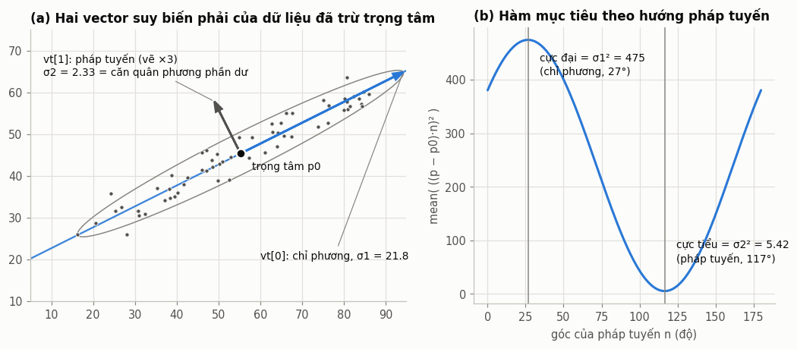
  <figcaption>Hình 3. (a) Hai vector suy biến phải của dữ liệu đã trừ trọng tâm; elip là đường mức 2σ. (b) Hàm mục tiêu theo góc của pháp tuyến: cực tiểu đúng bằng σ2² tại hướng vt[1], cực đại bằng σ1² tại hướng vt[0].</figcaption>
</figure>

**Code.**

```python title="fitting.py: fit_line_tls"
def fit_line_tls(points, weights=None) -> LineFit:
    p = as_xy(points)
    if len(p) < 2:
        raise ValueError("fit_line_tls cần ít nhất 2 điểm")
    w = _weights(len(p), weights)
    p0 = (w[:, None] * p).sum(axis=0) / w.sum()          # trọng tâm dùng w, không phải sqrt(w)
    q = (p - p0) * np.sqrt(w)[:, None]                   # mỗi hàng nhân sqrt(w) -> hiệp phương sai có trọng số w
    _, s, vt = np.linalg.svd(q, full_matrices=False)
    return LineFit(p0=p0, direction=vt[0], info={"singular_values": s})
```

Giải thích từng dòng:

- `p0 = ...`: trọng tâm (có trọng số, dùng cho Tukey ở [mục 2.5](#tukey-duong-thang)). Khi `weights=None` thì đây là trung bình thường.
- `q = (p - p0) * sqrt(w)`: trừ trọng tâm rồi nhân mỗi hàng với $\sqrt{w_i}$. Lý do là $\lVert Q_w n\rVert^2 = \sum_i w_i (q_i\cdot n)^2$, đúng là hàm mục tiêu có trọng số.
- `np.linalg.svd(q)`: `vt[0]` là chỉ phương. Pháp tuyến lấy bằng cách xoay chỉ phương 90°: `normal = (-d_y, d_x)` (trong `LineFit.normal`) để dấu của nó nhất quán.
- `full_matrices=False`: không tính ma trận $U$ đầy đủ kích thước $N \times N$ (với $N = 10\,000$ điểm, đó là 800 megabyte vô ích).

!!! warning "Lỗi hay gặp với phiên bản có trọng số"
    Trọng tâm có trọng số phải là $\sum w_i p_i / \sum w_i$. Nếu viết nhầm thành $\sum \sqrt{w_i}\, p_i / \sum \sqrt{w_i}$ (vì đã có sẵn biến `sqrt_w` cho bước phân tích giá trị suy biến), điểm có trọng số trung bình bị tính quá tay, làm trọng tâm lệch về phía các điểm đáng ngờ. Điểm có $w = 0$ vẫn bị loại nên lỗi này khó phát hiện bằng mắt, nhưng làm fit hơi lệch.

**Độ phức tạp:** $O(N)$, một lần phân tích giá trị suy biến của ma trận $N \times 2$. Rất nhanh, nhưng **không có khả năng chống ngoại lai**: một điểm ở xa 50 pixel góp $50^2 = 2500$ vào hàm mục tiêu, bằng 2500 điểm lệch 1 pixel.

### 2.3 RANSAC cho đường thẳng { #ransac-duong-thang }

**Ý tưởng** (Fischler và Bolles, 1981). Thay vì dùng *tất cả* điểm để fit rồi hy vọng ngoại lai không ảnh hưởng nhiều, hãy:

1. Lấy ngẫu nhiên **tập mẫu tối thiểu** ($s = 2$ điểm cho đường thẳng) và dựng một mô hình *giả thuyết*.
2. Đếm xem bao nhiêu điểm nằm trong dải $\lvert d_i \rvert < \text{tol}$ quanh giả thuyết. Đó là mức **đồng thuận** (consensus).
3. Lặp lại nhiều lần, giữ giả thuyết có đồng thuận lớn nhất.
4. Fit lại (Total Least Squares) trên các điểm trong (inlier) của giả thuyết thắng.

Chỉ cần **một lần** lấy trúng 2 điểm đều là inlier là thuật toán thắng, bất kể ngoại lai nhiều đến đâu, miễn là số inlier đông hơn cụm ngoại lai lớn nhất.

<figure markdown>
  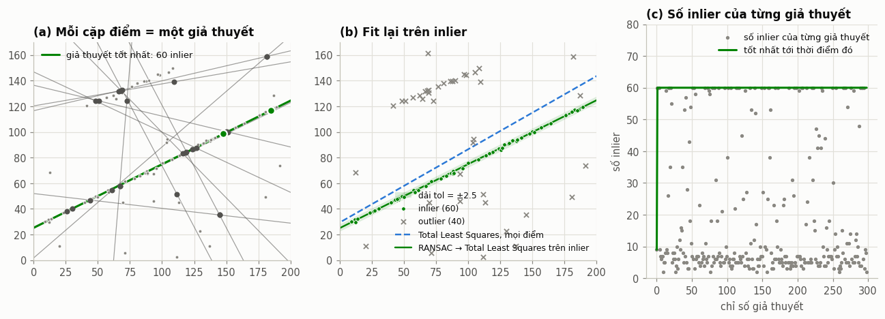
  <figcaption>Hình 4. 60 inlier, 18 điểm trên một cạnh lân cận và 22 điểm ngẫu nhiên (40% ngoại lai). (a) Mỗi cặp điểm tạo một giả thuyết (xám); giả thuyết thắng có 60 inlier (xanh lá). (b) Total Least Squares trên mọi điểm (nét đứt) bị kéo lệch; RANSAC rồi Total Least Squares trên inlier khớp đúng. (c) Số inlier của từng giả thuyết: phần lớn giả thuyết là rác, nhưng chỉ cần một giả thuyết tốt.</figcaption>
</figure>

**Cần bao nhiêu vòng lặp?** Gọi $w$ là tỉ lệ inlier, $s$ là kích thước mẫu. Xác suất một mẫu "sạch" (toàn inlier) là $w^s$. Xác suất cả $N$ mẫu đều bẩn là $(1 - w^s)^N$. Muốn xác suất thành công ít nhất $p$:

$$
(1 - w^s)^N \le 1 - p \quad\Longrightarrow\quad N \ge \frac{\log(1 - p)}{\log(1 - w^s)}
$$

```python title="fitting.py: ransac_iterations"
def ransac_iterations(p_success: float, inlier_ratio: float, sample_size: int) -> int:
    w_s = inlier_ratio ** sample_size
    if w_s >= 1.0:
        return 1
    if w_s <= 0.0:
        return 10 ** 9
    return int(math.ceil(math.log(1.0 - p_success) / math.log(1.0 - w_s)))
```

Với $p = 0.99$:

| tỉ lệ inlier $w$ | 0.9 | 0.7 | 0.5 | 0.3 | 0.2 | 0.1 |
|---|---|---|---|---|---|---|
| đường thẳng ($s = 2$) | 3 | 7 | 17 | 49 | 113 | 459 |
| đường tròn ($s = 3$) | 4 | 11 | 35 | 169 | 574 | 4603 |

<figure markdown>
  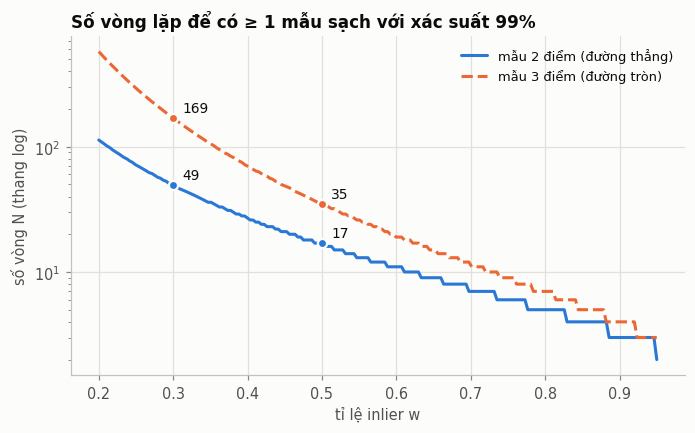{ width="620" }
  <figcaption>Hình 5. Số vòng lặp tăng theo hàm mũ khi tỉ lệ inlier giảm, và tăng nhanh hơn khi mẫu cần nhiều điểm hơn.</figcaption>
</figure>

Hai hệ quả thực tế:

- Với caliper (mỗi caliper cho 1 điểm, phần lớn là inlier), vài chục tới vài trăm vòng là quá đủ.
- Với bản đồ biên từ Canny trong cả một vùng (biên của lỗ có khi chỉ chiếm 10% điểm), đường tròn cần hàng nghìn vòng. Đây là lý do nhiều code dùng mặc định `iters=3000` cho đường tròn.

**Code, phiên bản dễ đọc.** Khung RANSAC tổng quát, dùng được cho mọi mô hình, có **số vòng thích nghi**: mỗi khi tìm được giả thuyết tốt hơn, ước lượng lại $w$ và cập nhật số vòng cần thiết.

```python title="fitting.py: ransac_generic"
def ransac_generic(points, sample_size, fit_minimal, residual_fn, refine, tol,
                   p_success=0.99, max_iters=10000, rng=None):
    p = as_xy(points)
    n = len(p)
    rng = np.random.default_rng(0) if rng is None else rng
    best_model, best_mask, best_count = None, None, 0
    needed, it = max_iters, 0
    while it < min(needed, max_iters):
        it += 1
        sample = p[rng.choice(n, size=sample_size, replace=False)]
        model = fit_minimal(sample)
        if model is None:
            continue
        mask = residual_fn(model, p) < tol
        count = int(mask.sum())
        if count > best_count:
            best_model, best_mask, best_count = model, mask, count
            # Cập nhật số vòng cần thiết theo tỉ lệ inlier tốt nhất đã thấy.
            needed = ransac_iterations(p_success, count / n, sample_size)
    if best_model is None:
        return None, None, it
    model = refine(p[best_mask])
    mask = residual_fn(model, p) < tol
    return refine(p[mask]), mask, it
```

Trên dữ liệu kiểm thử với 30% ngoại lai, phiên bản này dừng sau **11 vòng** cho đường tròn mà vẫn cho kết quả giống hệt phiên bản chạy 3000 vòng.

**Code, phiên bản vector hóa.** Trong Python, vòng lặp chậm; cách nhanh hơn là sinh *toàn bộ* giả thuyết một lúc và tính khoảng cách bằng phép toán ma trận:

```python title="fitting.py: fit_line_ransac"
def fit_line_ransac(points, tol=2.0, iters=500, rng=None):
    p = as_xy(points)
    n = len(p)
    if n < 2:
        return None
    rng = np.random.default_rng(0) if rng is None else rng   # cố định seed -> kết quả lặp lại được
    idx = rng.integers(0, n, size=(int(iters), 2))
    a, b = p[idx[:, 0]], p[idx[:, 1]]
    d = b - a
    length = np.linalg.norm(d, axis=1)
    ok = length > 1e-9                                        # loại cặp trùng điểm
    if not ok.any():
        return None
    a, d, length, idx = a[ok], d[ok], length[ok], idx[ok]
    normal = np.column_stack([-d[:, 1], d[:, 0]]) / length[:, None]
    # |(p - a) . n|: lấy trị tuyệt đối SAU tích vô hướng.
    dist = np.abs(((p[None, :, :] - a[:, None, :]) * normal[:, None, :]).sum(-1))
    counts = (dist < tol).sum(axis=1)
    best = int(counts.argmax())
    mask = dist[best] < tol
    if mask.sum() < 2:
        return None
    fit = fit_line_tls(p[mask])
    # Thu lại inlier theo đường đã tinh chỉnh (ổn định hơn đường qua 2 điểm).
    mask = np.abs(fit.residuals(p)) < tol
    fit = fit_line_tls(p[mask])
    fit.inliers = mask
    ...
    return fit
```

Giải thích các điểm quan trọng:

- **`rng = np.random.default_rng(0)`: cố định seed.** RANSAC là ngẫu nhiên; nếu không cố định seed, cùng một ảnh chạy hai lần có thể ra hai con số khác nhau ở chữ số thập phân thứ hai, và mọi báo cáo độ lặp lại (repeatability) của hệ đo trở nên vô nghĩa.
- **`rng.integers(0, n, size=(iters, 2))`: lấy mẫu có hoàn lại**, nên có thể bốc trùng một điểm hai lần. Cặp trùng có `length = 0` và bị loại bởi `ok`.
- **`normal = (-d_y, d_x) / length`**: pháp tuyến đơn vị của từng giả thuyết.
- **`dist`**: ma trận kích thước `(số giả thuyết, n)`. Phép `p[None, :, :] - a[:, None, :]` dùng broadcasting để trừ mọi điểm cho mọi điểm gốc. Bộ nhớ: 500 giả thuyết × 2000 điểm × 2 thành phần × 8 byte ≈ 16 megabyte, chấp nhận được. Với nhiều điểm hơn thì phải chia khối (xem RANSAC cho đường tròn ở [mục 3.5](#ransac-duong-tron)).
- **Dấu trị tuyệt đối phải đặt sau tổng.** Viết nhầm `np.abs(...) * normal` rồi mới cộng sẽ tính $\lvert\Delta x\, n_x\rvert + \lvert\Delta y\, n_y\rvert$, *không phải* khoảng cách, và lỗi này không gây crash nên rất khó phát hiện.
- **Fit lại hai lần.** Đường qua đúng 2 điểm mẫu bị ảnh hưởng bởi nhiễu của chính 2 điểm đó. Fit Total Least Squares trên inlier, rồi *thu lại* inlier theo đường mới, sẽ ổn định hơn.

**Chọn tham số:**

- `tol` khoảng 2 tới 3 lần độ lệch chuẩn nhiễu của điểm biên. Caliper dưới pixel thường có nhiễu 0.1 tới 0.5 pixel; điểm biên nguyên pixel từ Canny khoảng 0.5 tới 1 pixel. `tol` quá nhỏ thì loại cả inlier; quá lớn thì nhận cả ngoại lai sát biên.
- `iters` tra bảng ở trên, cộng hệ số an toàn.

**Mở rộng đáng biết:** MSAC (M-estimator Sample Consensus) chấm điểm giả thuyết bằng tổng $\min(d_i^2, \text{tol}^2)$ thay vì đếm, nên phân biệt được hai giả thuyết có cùng số inlier; LO-RANSAC (Locally Optimized RANSAC) fit lại cục bộ mỗi khi tìm được giả thuyết tốt hơn; PROSAC (Progressive Sample Consensus) ưu tiên lấy mẫu từ các điểm có chất lượng cao (ví dụ gradient mạnh).

### 2.4 Trimmed: cắt tỉa lặp { #trimmed-duong-thang }

**Ý tưởng.** Fit trên mọi điểm → tính phần dư → **bỏ các điểm có $\lvert d_i\rvert > k \cdot s$** ($s$ là thang đo nhiễu) → fit lại trên các điểm còn lại → lặp vài vòng.

```python title="fitting.py: fit_line_trimmed"
def fit_line_trimmed(points, rounds=3, k=2.5, scale="mad", min_points=5) -> LineFit:
    p = as_xy(points)
    keep = np.ones(len(p), dtype=bool)
    fit = fit_line_tls(p)
    history = [(fit.p0.copy(), fit.direction.copy(), keep.copy())]
    for _ in range(int(rounds)):
        d = np.abs(fit.residuals(p))
        s = _trim_scale(d, keep, scale)
        if s < 1e-9:
            break
        new_keep = d <= k * s
        if new_keep.sum() < min_points or np.array_equal(new_keep, keep):
            break
        keep = new_keep
        fit = fit_line_tls(p[keep])
        history.append((fit.p0.copy(), fit.direction.copy(), keep.copy()))
    fit.inliers = keep
    fit.info = {"history": history}
    return fit
```

Chi tiết cần chú ý:

- **Phần dư tính trên *mọi* điểm**, không chỉ các điểm đang giữ. Nhờ vậy một điểm bị loại oan ở vòng trước vẫn có thể được nhận lại khi fit tốt hơn.
- **Điều kiện dừng:** tập giữ lại không đổi (đã hội tụ), hoặc còn quá ít điểm.
- **Cách chọn thang đo $s$ quyết định chất lượng**: xem phân tích chi tiết ở [mục 3.4](#chon-thang-do). Tóm tắt: dùng $s = 1.4826 \cdot \operatorname{median}\lvert d\rvert$.

Một biến thể đơn giản hơn là **bỏ đúng $N$ điểm tệ nhất** (người vận hành thường nghĩ theo kiểu "bỏ 2 caliper tệ nhất" hơn là theo phần trăm):

```python title="fitting.py: fit_line_reject_n"
def fit_line_reject_n(points, reject_n: int) -> LineFit:
    p = as_xy(points)
    fit = fit_line_tls(p)
    ...
    order = np.argsort(np.abs(fit.residuals(p)))
    keep = np.zeros(len(p), dtype=bool)
    keep[order[: len(p) - int(reject_n)]] = True
    fit = fit_line_tls(p[keep])
    fit.inliers = keep
    return fit
```

<figure markdown>
  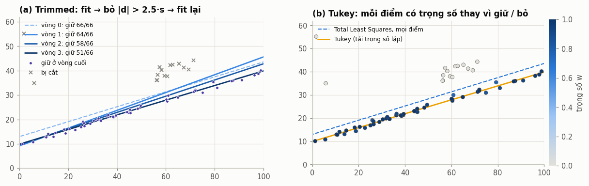
  <figcaption>Hình 6. Cạnh có một bavia (12 điểm lệch lên 4 tới 9 pixel) và 4 điểm rác. (a) Trimmed: đường ở vòng 0 (nét đứt) bị kéo lên; qua từng vòng, các điểm bavia bị cắt dần và đường trở về đúng cạnh. (b) Tukey: không cắt cứng, mỗi điểm có trọng số từ 0 tới 1 (màu điểm).</figcaption>
</figure>

### 2.5 Tukey: tái trọng số lặp { #tukey-duong-thang }

**Ý tưởng.** Bình phương tối thiểu cực tiểu $\sum d_i^2$, tức hàm mất mát $\rho(u) = u^2/2$ tăng không giới hạn, nên một điểm càng xa càng có "tiếng nói" lớn. Ước lượng M (M-estimator) thay $\rho$ bằng một hàm tăng chậm hơn, hoặc bão hòa hẳn:

$$
\min_\theta \sum_i \rho\!\left(\frac{d_i(\theta)}{s}\right)
$$

Đạo hàm theo tham số $\theta$ và đặt $\psi = \rho'$, rồi viết $\psi(u) = w(u)\, u$:

$$
\sum_i \psi(u_i)\,\frac{\partial d_i}{\partial \theta} = 0
\quad\Longleftrightarrow\quad
\sum_i w(u_i)\, d_i\, \frac{\partial d_i}{\partial \theta} = 0
$$

Vế phải chính là phương trình chuẩn của **bình phương tối thiểu có trọng số** với trọng số $w_i$ *cố định*. Từ đó ra thuật toán tái trọng số lặp (Iteratively Reweighted Least Squares): tính trọng số từ phần dư hiện tại → giải bình phương tối thiểu có trọng số → tính lại phần dư → lặp.

Hai hàm hay dùng:

| | $\rho(u)$ | $w(u)$ | Hằng số thường dùng |
|---|---|---|---|
| Huber | $u^2/2$ khi $\lvert u\rvert \le k$, ngược lại $k\lvert u\rvert - k^2/2$ | $1$ hoặc $k/\lvert u\rvert$ | $k = 1.345$ |
| Tukey biweight | $\frac{c^2}{6}\big[1 - (1 - (u/c)^2)^3\big]$ khi $\lvert u\rvert < c$, ngược lại $c^2/6$ | $(1 - (u/c)^2)^2$ hoặc $0$ | $c = 4.685$ |

Cả hai hằng số được chọn để khi nhiễu thực sự là Gauss, ước lượng đạt **95% hiệu suất** so với bình phương tối thiểu (mất rất ít độ chính xác trên dữ liệu sạch).

<figure markdown>
  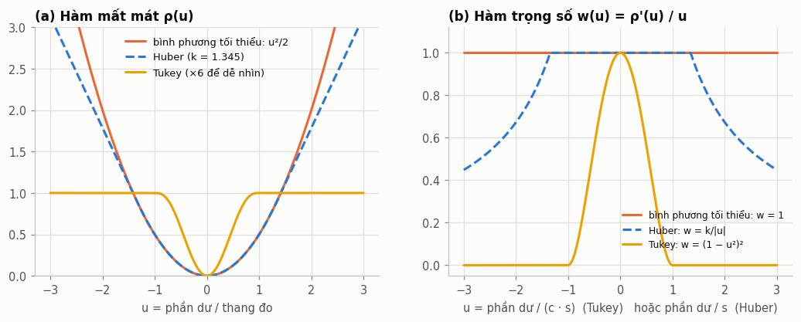
  <figcaption>Hình 7. (a) Hàm mất mát: bình phương tối thiểu tăng như u², Huber tăng tuyến tính, Tukey bão hòa. (b) Trọng số: Huber không bao giờ về 0 (ngoại lai vẫn kéo một chút); Tukey về đúng 0 khi |u| ≥ c (ngoại lai bị bỏ hẳn).</figcaption>
</figure>

**Thang đo $s$** phải bền vững, nếu không chính ngoại lai sẽ làm $s$ phình to và không điểm nào bị giảm trọng số. Dùng độ lệch tuyệt đối trung vị (median absolute deviation):

$$
s = 1.4826 \cdot \operatorname{median}_i \big\lvert d_i - \operatorname{median}_j d_j \big\rvert
$$

Hệ số $1.4826 = 1/\Phi^{-1}(0.75)$ làm cho $s = \sigma$ khi nhiễu là Gauss. Trung vị chịu được tới 50% ngoại lai mà không bị kéo.

```python title="fitting.py: mad_scale, tukey_weights, fit_line_tukey"
def mad_scale(res: np.ndarray) -> float:
    res = np.asarray(res, dtype=np.float64)
    return 1.4826 * float(np.median(np.abs(res - np.median(res)))) + 1e-12


def tukey_weights(u: np.ndarray) -> np.ndarray:
    return np.where(np.abs(u) < 1.0, (1.0 - u * u) ** 2, 0.0)


def fit_line_tukey(points, init=None, c=4.685, iters=10) -> LineFit:
    p = as_xy(points)
    fit = init if init is not None else fit_line_tls(p)
    w = np.ones(len(p))
    for _ in range(int(iters)):
        res = fit.residuals(p)
        s = mad_scale(res)
        w = tukey_weights(res / (c * s))
        if (w > 0).sum() < 2:
            break
        fit = fit_line_tls(p, weights=w)
    fit.inliers = w > 0
    fit.info = {"weights": w}
    return fit
```

- `res / (c * s)`: chuẩn hóa để ngưỡng cắt là $\lvert d\rvert = c \cdot s \approx 4.7\sigma$.
- `fit_line_tls(p, weights=w)`: bước "giải bình phương tối thiểu có trọng số" chính là Total Least Squares có trọng số ở [mục 2.2](#total-least-squares).
- `+ 1e-12` trong `mad_scale`: tránh chia cho 0 khi dữ liệu hoàn hảo (ví dụ dữ liệu tổng hợp không nhiễu).

!!! note "Tukey cần điểm khởi tạo tốt"
    Vì trọng số về 0, hàm mục tiêu của Tukey **không lồi**: có nhiều cực tiểu địa phương. Khởi tạo từ một fit bị kéo lệch nhiều, thuật toán có thể hội tụ về cực tiểu sai (xem [hình 11b](#ransac-duong-tron): Tukey khởi tạo từ Taubin lệch 8.6 pixel). Cách dùng chuẩn là: **RANSAC để khởi tạo, rồi Tukey để tinh chỉnh**.

---

## 3. Đường tròn { #duong-tron }

### 3.1 Kasa: bình phương tối thiểu đại số { #kasa }

**Ý tưởng** (Kasa, 1976). Khai triển phương trình đường tròn:

$$
(x-a)^2 + (y-b)^2 = r^2
\;\;\Longleftrightarrow\;\;
x^2 + y^2 = 2a\,x + 2b\,y + c, \qquad c = r^2 - a^2 - b^2
$$

Đây là phương trình **tuyến tính** theo $(a, b, c)$. Với $N$ điểm, ta có hệ quá xác định $A\,[a, b, c]^\top = z$ với hàng $i$ của $A$ là $[2x_i,\; 2y_i,\; 1]$ và $z_i = x_i^2 + y_i^2$. Giải bằng bình phương tối thiểu, rồi $r = \sqrt{c + a^2 + b^2}$.

```python title="fitting.py: fit_circle_kasa"
def fit_circle_kasa(points, weights=None) -> CircleFit:
    p = as_xy(points)
    if len(p) < 3:
        raise ValueError("fit_circle_kasa cần ít nhất 3 điểm")
    w = _weights(len(p), weights)
    m = (w[:, None] * p).sum(axis=0) / w.sum()
    x, y = p[:, 0] - m[0], p[:, 1] - m[1]
    sw = np.sqrt(w)
    A = np.column_stack([2 * x, 2 * y, np.ones(len(x))]) * sw[:, None]
    b = (x * x + y * y) * sw
    (a0, b0, c0), *_ = np.linalg.lstsq(A, b, rcond=None)
    r = math.sqrt(max(c0 + a0 * a0 + b0 * b0, 0.0))
    return CircleFit(float(a0 + m[0]), float(b0 + m[1]), float(r))
```

- **Trừ trọng tâm trước** (`x, y = p - m`): với ảnh 2000 pixel, $x^2 + y^2$ cỡ $10^6$ trong khi cột hằng số bằng 1, làm ma trận có số điều kiện rất lớn. Trừ trọng tâm đưa các cột về cùng bậc độ lớn; kết quả cộng lại `m` ở cuối.
- **`* sw`**: nhân mỗi hàng với $\sqrt{w_i}$ để có bình phương tối thiểu có trọng số (dùng cho Tukey).
- **`max(..., 0.0)`**: chống căn của số âm do sai số làm tròn khi dữ liệu suy biến.

**Kasa thực sự cực tiểu hóa cái gì?** Phần dư của hệ tuyến tính là

$$
f_i = x_i^2 + y_i^2 - 2a x_i - 2b y_i - c = \rho_i^2 - r^2 = (\rho_i - r)(\rho_i + r) = d_i\,(2r + d_i) \approx 2r\, d_i
$$

Vậy

$$
J_{\text{Kasa}} = \sum_i f_i^2 \;\approx\; 4r^2 \sum_i d_i^2
$$

Hàm mục tiêu của Kasa bằng hàm mục tiêu hình học **nhân với $4r^2$**. Khi dữ liệu phủ kín cả vòng tròn, bán kính bị "khóa" chặt bởi hình học nên hệ số này không gây hại. Nhưng khi chỉ thấy **một cung ngắn**, rất nhiều đường tròn với bán kính khác nhau đều khớp cung đó gần như tốt ngang nhau, và Kasa sẽ chọn đường tròn **nhỏ hơn** vì hệ số $4r^2$ nhỏ hơn. Đây là độ lệch hệ thống, không phải nhiễu: lặp lại bao nhiêu lần cũng lệch cùng một chiều.

<figure markdown>
  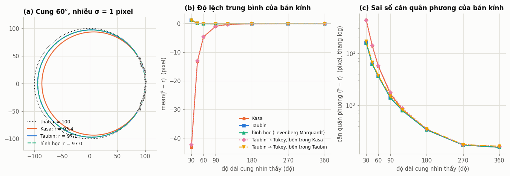
  <figcaption>Hình 8. (a) Cung 60° của đường tròn r = 100, nhiễu σ = 1 pixel: Kasa cho r = 93.4, Taubin 97.1, fit hình học 97.0 (cùng một lần lấy mẫu). (b) Độ lệch trung bình của bán kính qua 300 lần mô phỏng: Kasa lệch âm rất mạnh khi cung ngắn; Taubin và fit hình học gần như trùng nhau và gần 0. (c) Sai số căn quân phương: với cung ngắn, mọi phương pháp đều kém, nhưng Kasa kém nhất.</figcaption>
</figure>

### 3.2 Taubin { #taubin }

**Ý tưởng** (Taubin, 1991). Viết đường tròn dưới dạng đại số tổng quát:

$$
P(x, y) = A\,(x^2 + y^2) + B\,x + C\,y + D = 0
$$

Khoảng cách hình học từ một điểm tới đường cong $P = 0$ xấp xỉ bậc nhất bằng $\lvert P\rvert / \lVert\nabla P\rVert$. Ý tưởng của Taubin là **chuẩn hóa phần dư đại số bằng độ lớn gradient**, nhưng lấy trung bình trên toàn bộ tập điểm (để bài toán vẫn giải được bằng đại số tuyến tính):

$$
\min_{A, B, C, D} \; \frac{\sum_i P(x_i, y_i)^2}{\sum_i \lVert \nabla P(x_i, y_i) \rVert^2}
$$

Vì sao cách này hết độ lệch? Gần đường tròn, $P_i \approx 2Ar\, d_i$ và $\lVert\nabla P_i\rVert^2 \approx 4A^2 r^2$, nên tỉ số $\approx \sum_i d_i^2 / N$: hệ số $r^2$ **triệt tiêu** giữa tử và mẫu. Kasa thì tương đương cố định $A = 1$, để lại nguyên hệ số $4r^2$.

**Biến đổi thành bài toán phân tích giá trị suy biến.** Tỉ số trên không đổi khi nhân $(A, B, C, D)$ với một hằng số, nên ta cố định mẫu số và cực tiểu hóa tử số:

$$
\min \sum_i P_i^2 \quad \text{với} \quad \frac{1}{N}\sum_i \lVert \nabla P_i \rVert^2 = 1
$$

Gradient: $\nabla P = (2Ax + B,\; 2Ay + C)$, nên

$$
\frac{1}{N}\sum_i \lVert\nabla P_i\rVert^2 = 4A^2\,\overline{z} + 4AB\,\overline{x} + 4AC\,\overline{y} + B^2 + C^2, \qquad z = x^2 + y^2
$$

Bốn bước biến đổi:

1. **Trừ trọng tâm**: dùng tọa độ $u = x - \bar x$, $v = y - \bar y$, nên $\bar u = \bar v = 0$. Ràng buộc gọn lại thành $4A^2 \bar z + B^2 + C^2 = 1$ (với $z = u^2 + v^2$).
2. **Khử $D$**: với $(A, B, C)$ cố định, $D$ tối ưu làm trung bình phần dư bằng 0: $D = -A\bar z$. Thay vào, phần dư thành $A(z_i - \bar z) + B u_i + C v_i$.
3. **Đổi biến** $A' = 2\sqrt{\bar z}\,A$. Phần dư thành $A' z'_i + B u_i + C v_i$ với $z'_i = \dfrac{z_i - \bar z}{2\sqrt{\bar z}}$, và ràng buộc thành $A'^2 + B^2 + C^2 = 1$.
4. Bây giờ đúng là bài toán $\min \lVert M a\rVert$ với $\lVert a\rVert = 1$, $M = [\,z',\; u,\; v\,]$. Nghiệm: $a = (A', B, C)$ = `vt[-1]`.

Khôi phục đường tròn từ $P = 0$:

$$
u^2 + v^2 + \tfrac{B}{A}u + \tfrac{C}{A}v + \tfrac{D}{A} = 0
\;\;\Longrightarrow\;\;
u_c = -\frac{B}{2A},\quad v_c = -\frac{C}{2A},\quad r^2 = u_c^2 + v_c^2 - \frac{D}{A} = u_c^2 + v_c^2 + \bar z
$$

```python title="fitting.py: fit_circle_taubin"
def fit_circle_taubin(points, weights=None) -> CircleFit:
    p = as_xy(points)
    if len(p) < 3:
        raise ValueError("fit_circle_taubin cần ít nhất 3 điểm")
    w = _weights(len(p), weights)
    m = (w[:, None] * p).sum(axis=0) / w.sum()               # (1) trọng tâm
    u, v = p[:, 0] - m[0], p[:, 1] - m[1]
    z = u * u + v * v
    zmean = float((w * z).sum() / w.sum())
    if zmean <= 0:
        return fit_circle_kasa(p, weights)
    z0 = (z - zmean) / (2.0 * math.sqrt(zmean))               # (2)+(3) khử D, đổi biến
    M = np.column_stack([z0, u, v]) * np.sqrt(w)[:, None]
    _, _, vt = np.linalg.svd(M, full_matrices=False)          # (4) vector suy biến nhỏ nhất
    a_prime, B, C = vt[-1]
    A = a_prime / (2.0 * math.sqrt(zmean))                    # đổi biến ngược
    if abs(A) < 1e-14:                       # các điểm gần thẳng hàng: bán kính -> vô cùng
        return fit_circle_kasa(p, weights)
    cu, cv = -B / (2.0 * A), -C / (2.0 * A)
    r = math.sqrt(max(cu * cu + cv * cv + zmean, 0.0))
    return CircleFit(float(cu + m[0]), float(cv + m[1]), float(r))
```

Đối chiếu code với bốn bước:

- `m`, `u`, `v`: bước 1. Với trọng số, trọng tâm và $\bar z$ đều lấy theo trung bình có trọng số, và mỗi hàng của `M` nhân $\sqrt{w_i}$. Lập luận ở bước 1 tới 3 giữ nguyên, chỉ thay "trung bình" bằng "trung bình có trọng số".
- `z0`: gộp bước 2 và 3.
- `vt[-1]`: bước 4.
- `A = a_prime / (2 sqrt(zmean))`: đổi biến ngược để có $A$ thật.
- `abs(A) < 1e-14`: $A \to 0$ nghĩa là phương trình suy biến thành đường thẳng $Bx + Cy + D = 0$ (bán kính vô cùng). Đây là trường hợp các điểm gần thẳng hàng; khi đó trả về Kasa cho an toàn (thực tế nên báo lỗi cho tầng trên).

**Chi phí:** giống hệt Kasa ($O(N)$, một lần phân tích giá trị suy biến $N \times 3$), vì vậy **không có lý do gì để dùng Kasa thay cho Taubin** khi chỉ cần một phép fit đại số.

### 3.3 Tham chiếu: fit hình học { #fit-hinh-hoc }

Để biết Taubin tốt đến đâu, ta cần "chuẩn vàng": cực tiểu hóa đúng tổng bình phương khoảng cách hình học $\sum_i (\rho_i - r)^2$. Không có nghiệm đóng, nên dùng Levenberg-Marquardt. Ma trận Jacobi của $d_i = \rho_i - r$ theo $(a, b, r)$:

$$
\frac{\partial d_i}{\partial a} = -\frac{x_i - a}{\rho_i}, \qquad
\frac{\partial d_i}{\partial b} = -\frac{y_i - b}{\rho_i}, \qquad
\frac{\partial d_i}{\partial r} = -1
$$

Mỗi bước giải $(J^\top J + \lambda\,\operatorname{diag}(J^\top J))\,\Delta = -J^\top d$: $\lambda$ nhỏ thì gần Gauss-Newton (nhanh), $\lambda$ lớn thì gần gradient descent (an toàn). Tăng $\lambda$ khi bước làm hàm mục tiêu tăng, giảm khi thành công.

```python title="fitting.py: fit_circle_geometric (rút gọn)"
    theta = np.array([f.cx, f.cy, f.r])          # khởi tạo từ Taubin
    for _ in range(int(iters)):
        dx, dy = p[:, 0] - theta[0], p[:, 1] - theta[1]
        rho = np.maximum(np.hypot(dx, dy), 1e-12)
        res = rho - theta[2]
        J = np.column_stack([-dx / rho, -dy / rho, -np.ones(len(p))])
        JtW = J.T * w
        H, g = JtW @ J, JtW @ res
        step = np.linalg.solve(H + lam * np.diag(np.diag(H) + 1e-12), -g)
        ...                                       # nhận bước nếu hàm mục tiêu giảm, điều chỉnh lam
```

Bảng ở [mục 4.1](#do-lech-cung-ngan) cho thấy **Taubin và fit hình học gần như trùng nhau** ở mọi độ dài cung, trong khi fit hình học chậm hơn khoảng 30 tới 70 lần và cần khởi tạo. Trong thực tế, Taubin là lựa chọn mặc định; fit hình học chỉ đáng dùng khi cần bù thêm phần lệch rất nhỏ còn lại, hoặc khi mô hình phức tạp hơn đường tròn.

### 3.4 Trimmed cho đường tròn { #trimmed-duong-tron }

Thuật toán giống hệt [mục 2.4](#trimmed-duong-thang), chỉ thay hàm fit bên trong:

```python title="fitting.py: fit_circle_trimmed"
def fit_circle_trimmed(points, rounds=3, k=2.5, scale="mad", inner="taubin", min_points=6):
    p = as_xy(points)
    if len(p) < min_points:
        return None
    fit_fn = _CIRCLE_FITS[inner]
    keep = np.ones(len(p), dtype=bool)
    fit = fit_fn(p)
    history = [(fit.cx, fit.cy, fit.r, keep.copy())]
    for _ in range(int(rounds)):
        d = np.abs(fit.residuals(p))
        s = _trim_scale(d, keep, scale)
        if s < 1e-9:
            break
        new_keep = d <= k * s
        if new_keep.sum() < min_points or np.array_equal(new_keep, keep):
            break
        keep = new_keep
        fit = fit_fn(p[keep])
        history.append((fit.cx, fit.cy, fit.r, keep.copy()))
    fit.inliers = keep
    fit.info = {"history": history}
    return fit
```

<figure markdown>
  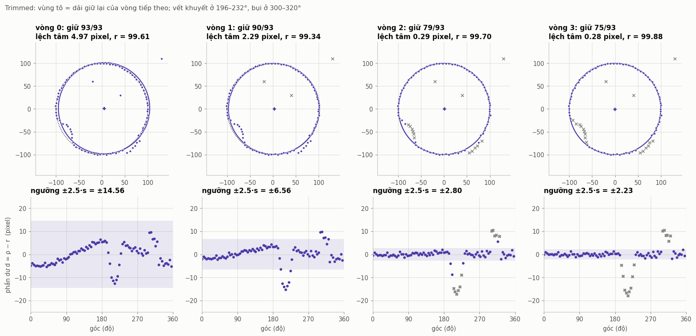
  <figcaption>Hình 9. Hàng trên: điểm giữ lại (tím), điểm bị cắt (dấu x), đường tròn fit ở mỗi vòng, đường chấm là đường tròn thật. Hàng dưới: phần dư theo góc; dải tô là ngưỡng ±2.5·s dùng để cắt ở vòng tiếp theo. Tâm lệch 4.97 → 2.29 → 0.29 → 0.28 pixel.</figcaption>
</figure>

Hàng dưới của hình 9 là cách nhìn quan trọng nhất để hiểu Trimmed. Ở vòng 0, fit bị vết khuyết (196 tới 232°) kéo lệch nên phần dư của các điểm *tốt* có dạng hình sin (dấu hiệu tâm bị lệch), và ngưỡng rất rộng (±14.6 pixel) vì $s$ bị các điểm xấu làm phình. Mỗi vòng, fit tốt hơn nên $s$ nhỏ đi, ngưỡng hẹp lại, các điểm khuyết và bụi lộ ra rõ hơn và bị cắt.

#### Chọn thang đo $s$: một chi tiết nhỏ ảnh hưởng lớn { #chon-thang-do }

Hàm `_trim_scale` hỗ trợ ba cách:

```python title="fitting.py: _trim_scale"
def _trim_scale(d, keep, scale):
    if scale == "mad":
        return 1.4826 * float(np.median(d))            # d >= 0 và có median ~ 0.674 sigma
    dk = d[keep] if keep.sum() > 5 else d
    if scale == "rms":
        return float(np.sqrt(np.mean(dk * dk)))
    if scale == "std_abs":
        return float(np.std(dk))
    raise ValueError(f"scale không hợp lệ: {scale}")
```

Cách `std_abs`, tức `np.std(np.abs(d))`, rất hay xuất hiện trong code thực tế vì trông "tự nhiên". Nhưng hãy xem nó cho gì khi dữ liệu **hoàn toàn sạch**, phần dư $d \sim \mathcal N(0, \sigma^2)$:

- $\lvert d\rvert$ có phân phối nửa chuẩn (half-normal): trung bình $\sigma\sqrt{2/\pi} \approx 0.80\sigma$, độ lệch chuẩn $\sigma\sqrt{1 - 2/\pi} \approx 0.60\sigma$.
- `np.std` đo độ phân tán **quanh trung bình 0.80σ**, trong khi ngưỡng lại so với **0**. Ngưỡng vòng 1 là $2.5 \times 0.60\sigma = 1.51\sigma$, cắt **13%** điểm tốt.
- Vòng 2 tính `std` trên tập đã bị cắt cụt nên còn $0.41\sigma$, ngưỡng $1.02\sigma$, và chỉ còn giữ lại khoảng **69%** điểm.

Mô phỏng 300 lần (đường tròn đầy đủ, 150 điểm, $\sigma = 1$, không có ngoại lai, 2 vòng):

| thang đo | cách tính | tỉ lệ điểm giữ lại | sai số tâm (căn quân phương) |
|---|---|---|---|
| `mad` | $1.4826 \cdot \operatorname{median}\lvert d\rvert$ trên mọi điểm | 98.6% | 0.170 pixel |
| `rms` | căn quân phương của $\lvert d\rvert$ trên điểm đang giữ | 98.3% | 0.181 pixel |
| `std_abs` | độ lệch chuẩn (`np.std`) của $\lvert d\rvert$ trên điểm đang giữ | **68.6%** | **0.226 pixel** |

Với `std_abs`, gần một phần ba số điểm tốt bị vứt bỏ, độ lặp lại kém đi khoảng 30%, và tỉ lệ inlier báo cáo (~0.69) **không phản ánh gì về ngoại lai thật**. Thang `mad` vừa đúng bằng $\sigma$ trên dữ liệu sạch, vừa không bị ngoại lai kéo (vì dùng trung vị trên mọi điểm).

**Giới hạn của Trimmed.** Mọi thứ tốt đẹp ở hình 9 dựa trên giả định: fit ban đầu đủ gần để phần lớn điểm tốt có phần dư nhỏ. Với ngoại lai dạng cụm từ khoảng 20% trở lên, giả định này sụp đổ (xem [hình 12b](#khang-ngoai-lai)): fit ban đầu nằm giữa hai vật thể, và việc cắt tỉa có thể loại chính các điểm của lỗ cần đo.

### 3.5 RANSAC cho đường tròn { #ransac-duong-tron }

Khung thuật toán giống [mục 2.3](#ransac-duong-thang), với hai khác biệt: mẫu tối thiểu là **3 điểm**, và ta có thể **lọc giả thuyết bằng tri thức có sẵn về bán kính**.

#### Đường tròn qua 3 điểm { #duong-tron-qua-3-diem }

Tâm $u$ cách đều ba điểm $a, b, c$:

$$
\lVert u - a\rVert^2 = \lVert u - b\rVert^2 \;\Rightarrow\; 2(b - a)\cdot u = \lVert b\rVert^2 - \lVert a\rVert^2
$$

$$
\lVert u - a\rVert^2 = \lVert u - c\rVert^2 \;\Rightarrow\; 2(c - a)\cdot u = \lVert c\rVert^2 - \lVert a\rVert^2
$$

Mỗi phương trình là một **đường trung trực**; tâm là giao điểm của chúng. Giải hệ $2 \times 2$ bằng quy tắc Cramer:

$$
d = 2\big(a_x(b_y - c_y) + b_x(c_y - a_y) + c_x(a_y - b_y)\big)
$$

$$
u_x = \frac{\lVert a\rVert^2 (b_y - c_y) + \lVert b\rVert^2 (c_y - a_y) + \lVert c\rVert^2 (a_y - b_y)}{d}, \qquad
u_y = \frac{\lVert a\rVert^2 (c_x - b_x) + \lVert b\rVert^2 (a_x - c_x) + \lVert c\rVert^2 (b_x - a_x)}{d}
$$

$d$ bằng 4 lần diện tích có dấu của tam giác $abc$, nên $d = 0$ khi và chỉ khi ba điểm thẳng hàng (hai đường trung trực song song, không có tâm).

<figure markdown>
  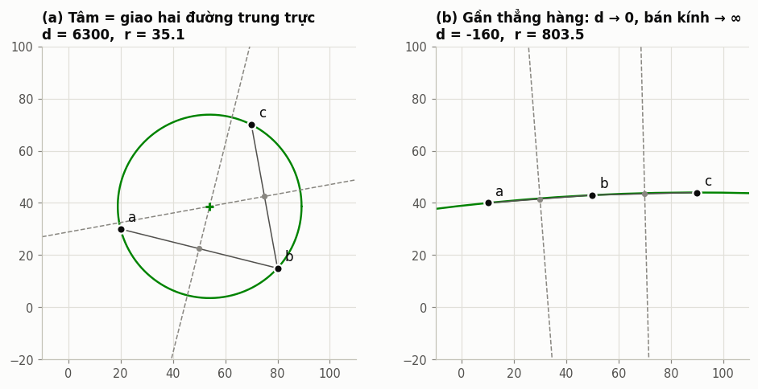{ width="760" }
  <figcaption>Hình 10. (a) Tâm là giao hai đường trung trực. (b) Ba điểm gần thẳng hàng: d nhỏ, bán kính lên tới 803; loại bằng điều kiện |d| > ε và bằng cổng bán kính.</figcaption>
</figure>

```python title="fitting.py: circumcircle"
def circumcircle(a, b, c):
    ax, ay = a[..., 0], a[..., 1]
    bx, by = b[..., 0], b[..., 1]
    cx, cy = c[..., 0], c[..., 1]
    d = 2.0 * (ax * (by - cy) + bx * (cy - ay) + cx * (ay - by))
    valid = np.abs(d) > 1e-9
    d = np.where(valid, d, 1.0)
    a2, b2, c2 = ax * ax + ay * ay, bx * bx + by * by, cx * cx + cy * cy
    ux = (a2 * (by - cy) + b2 * (cy - ay) + c2 * (ay - by)) / d
    uy = (a2 * (cx - bx) + b2 * (ax - cx) + c2 * (bx - ax)) / d
    r = np.hypot(ax - ux, ay - uy)
    return ux, uy, r, valid
```

`a[..., 0]` cho phép hàm chạy với một bộ 3 điểm lẻ, hoặc với mảng hàng nghìn bộ cùng lúc. `d = np.where(valid, d, 1.0)` tránh cảnh báo chia cho 0; kết quả của các bộ không hợp lệ bị bỏ qua nhờ `valid`.

#### Thuật toán vector hóa với cổng bán kính { #ransac-vector-hoa }

```python title="fitting.py: fit_circle_ransac"
def fit_circle_ransac(points, r_min=None, r_max=None, tol=2.5, iters=3000, chunk=512,
                      inner="taubin", rng=None):
    p = as_xy(points)
    n = len(p)
    if n < 3:
        return None
    rng = np.random.default_rng(0) if rng is None else rng
    idx = rng.integers(0, n, size=(int(iters), 3))
    ux, uy, r, valid = circumcircle(p[idx[:, 0]], p[idx[:, 1]], p[idx[:, 2]])
    gate = valid.copy()
    if r_min is not None:
        gate &= r >= r_min
    if r_max is not None:
        gate &= r <= r_max
    if not gate.any():
        return None
    hx, hy, hr = ux[gate], uy[gate], r[gate]
    px, py = p[:, 0][None, :], p[:, 1][None, :]
    counts = np.empty(len(hx), dtype=np.int64)
    for s in range(0, len(hx), int(chunk)):
        e = s + int(chunk)
        dist = np.abs(np.hypot(px - hx[s:e, None], py - hy[s:e, None]) - hr[s:e, None])
        counts[s:e] = (dist < tol).sum(axis=1)
    best = int(counts.argmax())
    best_hyp = CircleFit(float(hx[best]), float(hy[best]), float(hr[best]))
    mask = np.abs(best_hyp.residuals(p)) < tol
    if mask.sum() < 3:
        return None
    fit_fn = _CIRCLE_FITS[inner]
    fit = fit_fn(p[mask])
    mask = np.abs(fit.residuals(p)) < tol
    if mask.sum() >= 3:
        fit = fit_fn(p[mask])
    fit.inliers = mask
    ...
    return fit
```

Giải thích:

- **Sinh mọi giả thuyết cùng lúc**: `idx` có kích thước `(iters, 3)`; một lần gọi `circumcircle` tính ra `iters` đường tròn.
- **Cổng bán kính** `gate`: trong đo lường ta *luôn* biết kích thước danh định của lỗ (ví dụ đường kính 2.2 ± 0.3 milimét, đổi ra pixel qua hệ số hiệu chuẩn). Loại mọi giả thuyết có bán kính ngoài khoảng này gần như miễn phí, trước bước đếm inlier tốn kém. Ở hình 11, cổng loại gần một nửa số giả thuyết, bao gồm các giả thuyết dựng từ lỗ lân cận (bán kính 40) và các bộ 3 điểm gần thẳng hàng (bán kính rất lớn).
- **Đếm inlier theo khối** `chunk`: ma trận khoảng cách đầy đủ có kích thước `(số giả thuyết, n)`. Với 3000 giả thuyết và 5000 điểm, mỗi mảng tạm là 15 triệu số thực, tức 120 megabyte, và biểu thức tạo vài mảng tạm như vậy. Chia khối 512 giả thuyết giữ mỗi mảng tạm khoảng 20 megabyte.
- **Fit lại bằng Taubin** trên inlier, rồi thu inlier lần nữa. Dùng Taubin chứ không dùng Kasa, vì inlier có thể chỉ phủ một cung (lỗ bị che một phần).

<figure markdown>
  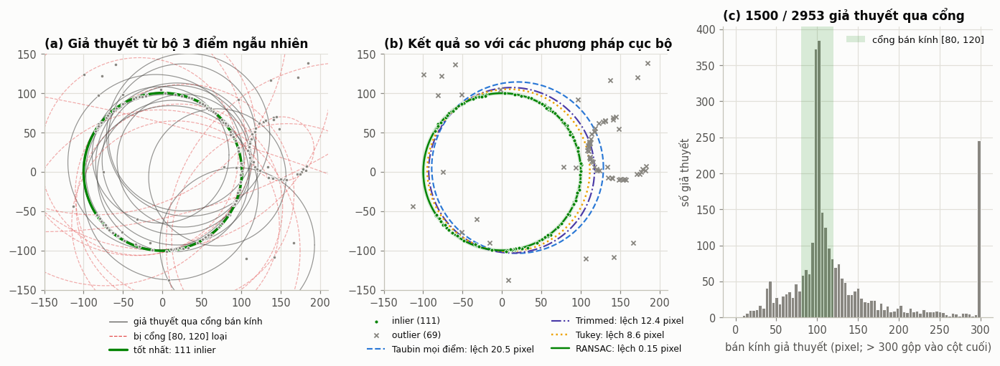
  <figcaption>Hình 11. Một cung 300° của lỗ cần đo (r = 100), 45 điểm của một lỗ lân cận nhỏ hơn, 25 điểm ngẫu nhiên. (a) Giả thuyết từ các bộ 3 điểm: nét xám qua được cổng [80, 120], nét đỏ đứt bị cổng loại. (b) Taubin trên mọi điểm lệch tâm 20.5 pixel, Trimmed 12.4 pixel, Tukey 8.6 pixel; RANSAC chỉ lệch 0.15 pixel. (c) Phân bố bán kính của mọi giả thuyết: một đỉnh tại 100 (lỗ cần đo), một đỉnh nhỏ tại 40 (lỗ lân cận).</figcaption>
</figure>

### 3.6 Tukey cho đường tròn, và cái bẫy "fit bên trong" { #tukey-duong-tron }

Thuật toán giống [mục 2.5](#tukey-duong-thang), nhưng có một lựa chọn quan trọng: **mỗi vòng dùng phương pháp fit có trọng số nào?**

```python title="fitting.py: fit_circle_tukey"
def fit_circle_tukey(points, init=None, inner="taubin", c=4.685, iters=10) -> CircleFit:
    p = as_xy(points)
    fit_fn = _CIRCLE_FITS[inner]
    fit = init if init is not None else fit_circle_taubin(p)
    w = np.ones(len(p))
    for _ in range(int(iters)):
        res = fit.residuals(p)
        s = mad_scale(res)
        w = tukey_weights(res / (c * s))
        if (w > 0).sum() < 6:
            break
        fit = fit_fn(p, weights=w)
    fit.inliers = w > 0
    fit.info = {"weights": w}
    return fit
```

Cách viết tự nhiên nhất là dùng Kasa có trọng số (chỉ cần nhân mỗi hàng của hệ tuyến tính với $\sqrt{w_i}$). Nhưng khi đó **kết quả cuối cùng là của Kasa**, bất kể điểm khởi tạo: khởi tạo bằng Taubin chỉ quyết định vòng lặp bắt đầu ở đâu, còn điểm hội tụ là cực tiểu của hàm mục tiêu Kasa có trọng số. Đường "Taubin → Tukey, bên trong Kasa" ở hình 8b nằm đè lên đường Kasa: lệch −42 pixel ở cung 30°, −4.7 pixel ở cung 60°. Dùng Taubin có trọng số (`inner="taubin"`) thì giữ được ưu điểm của Taubin.

Quy tắc chung: **trong một chuỗi xử lý bền vững (Trimmed, RANSAC rồi fit lại, Tukey), phương pháp fit bên trong quyết định độ lệch của kết quả cuối**. Nếu bên trong là Kasa, cả chuỗi mang độ lệch của Kasa trên cung ngắn.

---

## 4. So sánh tổng hợp { #so-sanh }

### 4.1 Độ lệch trên cung ngắn { #do-lech-cung-ngan }

Đường tròn $r = 100$, 40 điểm đều trên cung, nhiễu $\sigma = 1$ pixel, 300 lần mô phỏng mỗi độ dài cung. Mỗi ô là **độ lệch trung bình / sai số căn quân phương** của bán kính (pixel):

| cung | Kasa | Taubin | hình học | Taubin → Tukey (bên trong Kasa) | Taubin → Tukey (bên trong Taubin) |
|---|---|---|---|---|---|
| 30° | −43.20 / 43.62 | +1.23 / 15.95 | +1.31 / 15.96 | −42.34 / 42.79 | +1.20 / 16.87 |
| 45° | −13.11 / 13.97 | +0.14 / 6.13 | +0.16 / 6.14 | −13.06 / 14.02 | +0.12 / 6.66 |
| 60° | −4.61 / 5.68 | +0.01 / 3.63 | +0.01 / 3.62 | −4.65 / 5.73 | +0.05 / 3.74 |
| 90° | −0.93 / 1.67 | −0.07 / 1.40 | −0.07 / 1.39 | −0.94 / 1.76 | −0.07 / 1.51 |
| 120° | −0.28 / 0.84 | −0.03 / 0.79 | −0.03 / 0.79 | −0.29 / 0.88 | −0.04 / 0.83 |
| 180° | −0.03 / 0.34 | +0.01 / 0.34 | +0.01 / 0.34 | −0.03 / 0.36 | +0.00 / 0.35 |
| 360° | +0.01 / 0.16 | +0.01 / 0.16 | +0.00 / 0.16 | +0.00 / 0.17 | +0.00 / 0.17 |

Đọc bảng:

- Từ 180° trở lên, mọi phương pháp như nhau. Sự khác biệt chỉ xuất hiện khi thấy dưới nửa vòng tròn.
- Taubin trùng với fit hình học tới hai chữ số thập phân ở mọi độ dài cung.
- Ngay cả phương pháp tốt nhất, sai số ở cung 30° vẫn là 16 pixel. **Cung ngắn là bài toán điều kiện kém tự bản chất**: không thuật toán nào cứu được. Vì vậy, cùng với kết quả fit, nên luôn báo cáo *độ phủ góc* của inlier (ví dụ: inlier trải trên bao nhiêu độ) và từ chối kết quả khi độ phủ quá thấp.

### 4.2 Kháng ngoại lai { #khang-ngoai-lai }

Đường tròn đầy đủ $r = 100$, 150 điểm, nhiễu $\sigma = 1$; thay một phần điểm bằng ngoại lai theo hai kiểu ở [mục 1.2](#hai-loai-ngoai-lai). Trung vị sai số tâm qua 150 lần mô phỏng:

<figure markdown>
  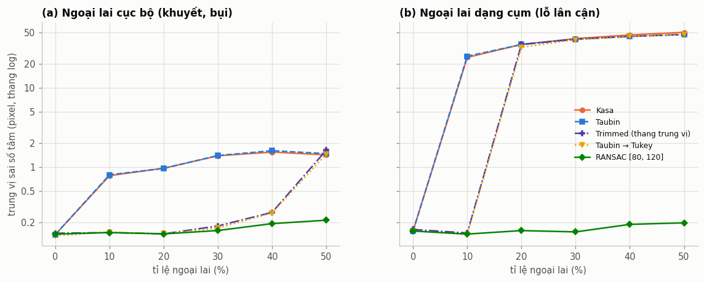
  <figcaption>Hình 12. (a) Ngoại lai cục bộ (biên lệch 5 tới 25% bán kính): Trimmed và Tukey tốt tới 40%, RANSAC tốt tới 50%. (b) Ngoại lai dạng cụm (một lỗ nhỏ lân cận): từ 20% trở lên, Trimmed và Tukey sụp đổ cùng Kasa và Taubin; chỉ RANSAC có cổng bán kính trụ vững.</figcaption>
</figure>

Trung vị sai số tâm (pixel):

| kiểu | phương pháp | 0% | 10% | 20% | 30% | 40% | 50% |
|---|---|---|---|---|---|---|---|
| cục bộ | Kasa | 0.14 | 0.78 | 0.97 | 1.39 | 1.54 | 1.42 |
| cục bộ | Taubin | 0.14 | 0.80 | 0.96 | 1.39 | 1.61 | 1.47 |
| cục bộ | Trimmed | 0.15 | 0.15 | 0.14 | 0.18 | 0.27 | 1.63 |
| cục bộ | Tukey | 0.14 | 0.15 | 0.14 | 0.17 | 0.26 | 1.46 |
| cục bộ | RANSAC | 0.14 | 0.15 | 0.14 | 0.16 | 0.19 | 0.21 |
| cụm | Kasa | 0.16 | 24.16 | 35.25 | 41.80 | 46.41 | 50.18 |
| cụm | Taubin | 0.16 | 24.99 | 35.15 | 41.05 | 44.41 | 47.11 |
| cụm | Trimmed | 0.16 | 0.15 | 35.15 | 41.05 | 44.41 | 47.11 |
| cụm | Tukey | 0.16 | 0.14 | 32.41 | 40.42 | 44.33 | 47.20 |
| cụm | RANSAC | 0.16 | 0.14 | 0.16 | 0.15 | 0.19 | 0.20 |

Nhận xét:

- Trên dữ liệu sạch (0%), mọi phương pháp như nhau: các phương pháp bền vững không làm mất độ chính xác (nhờ chọn thang đo đúng).
- Kasa và Taubin chỉ khác nhau khi cung ngắn, còn về ngoại lai thì **cả hai đều không có khả năng chống chịu**.
- Bước nhảy của Trimmed và Tukey từ 10% lên 20% ở hình 12b là "điểm gãy" (breakdown point) điển hình của phương pháp cục bộ: không phải xấu đi từ từ, mà đang đúng thì sai hẳn.

### 4.3 Ảnh tổng hợp từ đầu đến cuối { #anh-tong-hop }

Quay lại ảnh ở hình 1: 90 caliper xuyên tâm; giá trị thật: tâm $(181.37, 176.62)$, $r = 108.4$.

<figure markdown>
  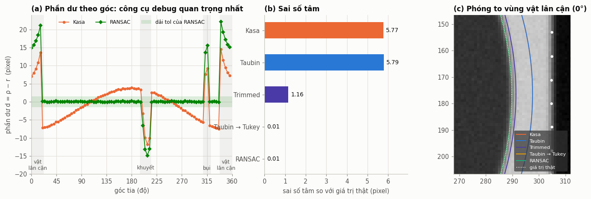
  <figcaption>Hình 13. (a) Phần dư theo góc tia: với Kasa, phần dư của các điểm tốt có dạng hình sin (tâm bị lệch); với RANSAC, mọi điểm tốt nằm trong dải ±1.5 pixel, còn vùng vật lân cận nhô lên 15 tới 22 pixel và vết khuyết lõm xuống tới −15 pixel. (b) Sai số tâm của từng phương pháp. (c) Phóng to vùng vật lân cận: các điểm biên (trắng) nằm trên cạnh của vật lân cận, kéo đường tròn Kasa và Taubin sang phải.</figcaption>
</figure>

| phương pháp | tâm x | tâm y | bán kính | sai số tâm | sai số bán kính |
|---|---|---|---|---|---|
| Kasa | 187.134 | 176.390 | 110.448 | 5.769 | +2.048 |
| Taubin | 187.157 | 176.380 | 110.449 | 5.792 | +2.049 |
| Trimmed | 182.504 | 176.384 | 108.831 | 1.159 | +0.431 |
| Taubin → Tukey | 181.367 | 176.626 | 108.384 | 0.007 | −0.016 |
| RANSAC (cổng [90, 125], tol 1.5) | 181.366 | 176.627 | 108.386 | 0.008 | −0.014 |

Ở ảnh này có 16 trên 90 điểm là ngoại lai, trong đó cụm của vật lân cận chỉ có 10 điểm (khoảng 11%, dưới điểm gãy) nên Tukey vẫn thành công. Trimmed chỉ cắt được một phần: fit ban đầu quá lệch nên sau 3 vòng vẫn còn giữ 3 ngoại lai (hai điểm lệch khoảng +14 pixel ở rìa vật lân cận, một điểm ở vết khuyết).

!!! tip "Đồ thị phần dư theo góc: công cụ debug quan trọng nhất"
    Khi một phép đo đường tròn cho kết quả lạ, hãy vẽ $d_i$ theo góc như hình 13a. Hình dạng của nó cho biết ngay nguyên nhân:

    - **Hình sin một chu kỳ** ($\cos(\theta - \varphi)$): tâm bị lệch, biên độ bằng độ lệch tâm, pha chỉ hướng lệch.
    - **Dịch đều lên hoặc xuống**: bán kính sai.
    - **Hình sin hai chu kỳ** ($\cos 2\theta$): vật hình elip, hoặc camera nghiêng, hoặc pixel không vuông.
    - **Gai cục bộ**: khuyết, bụi, bavia, hoặc caliper bắt nhầm vật khác.
    - **Nhiễu lớn đều khắp**: ảnh mờ, caliper quá ngắn hoặc lọc quá mạnh.

### 4.4 Thời gian chạy { #thoi-gian-chay }

Trung vị của 30 lần chạy, đơn vị mili giây, 20% ngoại lai (máy tính cá nhân, chỉ để so sánh tương đối):

| số điểm | Kasa | Taubin | hình học | Trimmed | Tukey | RANSAC (3000 giả thuyết) |
|---|---|---|---|---|---|---|
| 100 | 0.04 | 0.04 | 2.75 | 0.74 | 1.92 | 3.92 |
| 1000 | 0.24 | 0.22 | 7.83 | 1.33 | 4.52 | 58.24 |

RANSAC đắt nhất vì chi phí tỉ lệ với (số giả thuyết × số điểm). Với caliper, tỉ lệ inlier thường trên 70%, nên theo bảng ở [mục 2.3](#ransac-duong-thang) chỉ cần vài chục giả thuyết; giảm `iters` xuống 200 tới 300 cắt thời gian đi khoảng 10 lần. Chỉ dùng hàng nghìn giả thuyết cho bản đồ biên dày đặc có tỉ lệ inlier thấp.

---

## 5. Nên dùng phương pháp nào? { #chon-phuong-phap }

| Tình huống | Đường thẳng | Đường tròn |
|---|---|---|
| Dữ liệu sạch, đã lọc sẵn | Total Least Squares | Taubin |
| Chỉ thấy một cung ngắn | (không áp dụng) | Taubin, **không bao giờ dùng Kasa**; báo cáo độ phủ góc |
| Ngoại lai cục bộ (khuyết, bụi, bavia) | Trimmed hoặc Tukey | Trimmed (thang trung vị) hoặc Tukey (bên trong Taubin) |
| Có thể có vật lân cận, cạnh khác | RANSAC → Total Least Squares | RANSAC có cổng bán kính → Taubin |
| Cần độ chính xác và độ lặp lại cao nhất | RANSAC → Total Least Squares → Tukey | RANSAC → Taubin → Tukey (bên trong Taubin) |

Chuỗi xử lý khuyến nghị cho đường tròn trong đo lường:

```python
fit = fit_circle_ransac(points, r_min, r_max, tol=3 * sigma_edge, iters=300)   # toàn cục, bắt đúng vật
fit = fit_circle_tukey(points, init=fit, inner="taubin")                        # tinh chỉnh mềm
residual = fit.residuals(points[fit.inliers])
quality = {
    "rms": float(np.sqrt(np.mean(residual ** 2))),        # độ tròn / chất lượng biên
    "inlier_frac": float(fit.inliers.mean()),             # bao nhiêu caliper đáng tin
    "arc_coverage_deg": ...,                              # độ phủ góc của inlier
}
```

Mỗi bước giải quyết một việc: RANSAC chọn đúng vật thể và loại ngoại lai thô, Taubin cho nghiệm không lệch trên cung ngắn, Tukey xử lý các điểm "hơi lệch" mà dải `tol` cứng của RANSAC không phân biệt được. Các chỉ số chất lượng cho tầng trên quyết định có tin kết quả hay không.

---

## 6. Danh sách lỗi hay gặp { #loi-hay-gap }

1. **Dùng `y = a·x + b` cho cạnh trong ảnh.** Hỏng với cạnh gần thẳng đứng. Luôn dùng khoảng cách vuông góc.
2. **Dùng Kasa khi chỉ thấy một cung.** Bán kính bị ước lượng nhỏ đi một cách có hệ thống (−4.6 pixel ở cung 60°, −43 pixel ở cung 30°, với $r = 100$, $\sigma = 1$).
3. **Kasa "ẩn" bên trong chuỗi bền vững.** Tukey, Trimmed, hoặc bước fit lại sau RANSAC dùng Kasa có trọng số sẽ đưa lại đúng độ lệch đó, kể cả khi khởi tạo bằng Taubin.
4. **Thang đo cắt tỉa `np.std(np.abs(d))`.** Ngưỡng thực tế chỉ khoảng $1.0$ tới $1.5\sigma$, cắt khoảng 30% điểm tốt, và tỉ lệ inlier báo cáo mất ý nghĩa. Dùng $1.4826 \cdot \operatorname{median}\lvert d\rvert$.
5. **Trọng tâm có trọng số tính bằng $\sqrt{w}$** thay vì $w$ trong Total Least Squares có trọng số.
6. **Không cố định seed của RANSAC.** Cùng ảnh, hai lần chạy, hai kết quả khác nhau; báo cáo độ lặp lại mất ý nghĩa.
7. **Đặt trị tuyệt đối trước tích vô hướng** khi tính khoảng cách tới đường thẳng: $\lvert\Delta x\, n_x\rvert + \lvert\Delta y\, n_y\rvert$ không phải là khoảng cách.
8. **RANSAC không có cổng bán kính** khi đã biết kích thước danh định: tốn thời gian đếm inlier cho giả thuyết rác, và dễ khóa nhầm vào vật lân cận có nhiều điểm biên hơn.
9. **Tính ma trận khoảng cách (giả thuyết × điểm) một lần** với dữ liệu lớn: tràn bộ nhớ. Chia khối.
10. **Không trừ trọng tâm trước khi fit đại số**: ma trận có số điều kiện rất lớn khi tọa độ cỡ hàng nghìn pixel.
11. **Khởi tạo Tukey từ một fit không bền vững** khi có ngoại lai dạng cụm: hội tụ về nghiệm sai.
12. **Chỉ nhìn vào con số cuối cùng.** Luôn giữ lại (hoặc vẽ được) phần dư theo góc hoặc theo vị trí dọc cạnh; đó là cách nhanh nhất để biết thuật toán sai ở đâu.

---

## 7. Tài liệu tham khảo { #tai-lieu-tham-khao }

- M. A. Fischler, R. C. Bolles. *Random Sample Consensus: A Paradigm for Model Fitting with Applications to Image Analysis and Automated Cartography*. Communications of the ACM, 1981.
- I. Kåsa. *A circle fitting procedure and its error analysis*. IEEE Transactions on Instrumentation and Measurement, 1976.
- G. Taubin. *Estimation of Planar Curves, Surfaces and Nonplanar Space Curves Defined by Implicit Equations, with Applications to Edge and Range Image Segmentation*. IEEE Transactions on Pattern Analysis and Machine Intelligence, 1991.
- N. Chernov. *Circular and Linear Regression: Fitting Circles and Lines by Least Squares*. Chapman & Hall, 2010. (Dạng giải Taubin bằng phân tích giá trị suy biến dùng trong bài lấy từ đây.)
- A. Al-Sharadqah, N. Chernov. *Error analysis for circle fitting algorithms*. Electronic Journal of Statistics, 2009. (Phân tích lý thuyết độ lệch của Kasa, Pratt, Taubin, fit hình học, và phương pháp "Hyper" không lệch.)
- R. Hartley, A. Zisserman. *Multiple View Geometry in Computer Vision*, 2nd edition, 2004. Mục 4.7 về RANSAC và số vòng lặp.
- P. J. Huber, E. M. Ronchetti. *Robust Statistics*, 2nd edition, 2009. (Ước lượng M, hàm Huber và Tukey.)

---

## Phụ lục: toàn bộ mã nguồn { #phu-luc }

```python title="circle_line_fitting/fitting.py"
--8<-- "docs/image_processing/circle_line_fitting/fitting.py"
```
