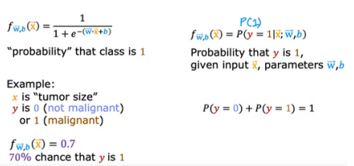
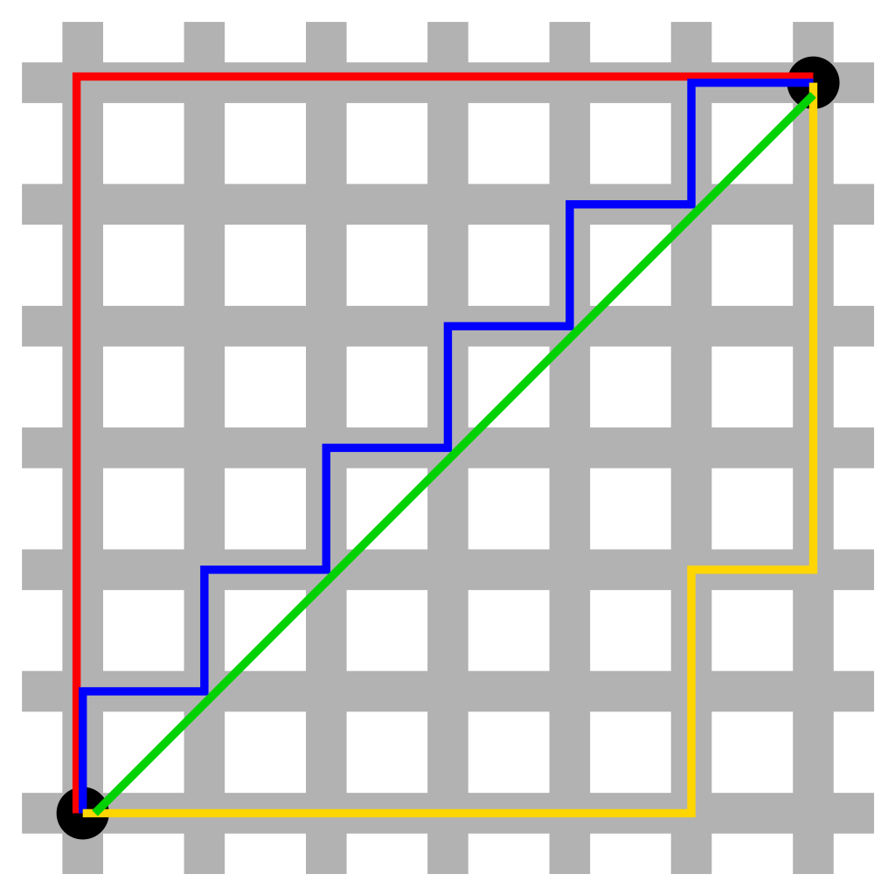
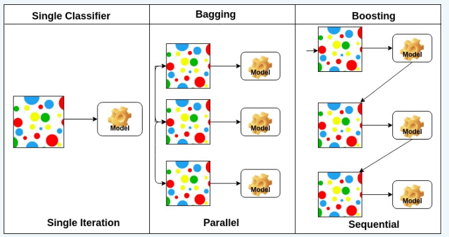

# #4. Supervised Learning Algorithms
Supervised Learning là một phương pháp học máy trong đó model được huấn luyện trên một tập dữ liệu đã được gán nhãn. Dự đoán đầu ra (outcome) của một dữ liệu mới (new input) dựa trên các cặp (input, outcome) đã biết từ trước.
## Linear Regression (Hồi quy tuyến tính)
### Simple and Multiple Linear Regression
Hồi quy tuyến tính đơn (Simple Linear Regression): Là phương pháp model hóa mối quan hệ giữa một biến phụ thuộc và một biến độc lập. Ví dụ: Dự đoán giá nhà dựa trên diện tích.
Hồi quy tuyến tính đa biến (Multiple Linear Regression): Mở rộng hồi quy tuyến tính đơn bằng cách thêm nhiều biến độc lập vào model. Ví dụ: Dự đoán giá nhà dựa trên diện tích, số phòng ngủ, và vị trí.
### Assumptions and Diagnostics
#### Assumptions (Giả định):
* Tính tuyến tính: Mối quan hệ giữa biến phụ thuộc và biến độc lập là tuyến tính.
* Độc lập của sai số: Các sai số trong model không có mối quan hệ với nhau.
* Homoscedasticity: Phương sai của sai số là đồng nhất.
* Phân phối chuẩn của sai số: Sai số có phân phối chuẩn.

#### Diagnostics (Chẩn đoán)
* Biểu đồ phần dư (Residual plots): Được sử dụng để kiểm tra các giả định như tính tuyến tính và homoscedasticity.
* Hệ số lạm phát phương sai (VIF): Kiểm tra hiện tượng đa cộng tuyến.
* Khoảng cách Cook: Xác định các điểm dữ liệu bất thường có ảnh hưởng lớn đến model.

## Logistic Regression
Khi output chỉ có thể nhận một số ít các giá trị thay vì bất kỳ số nào trong phạm vi vô hạn --> điều này dẫn đến một thuật toán được gọi là Logistic regression.

<figure markdown>

  { width="300"}
  <figcaption>Logistic Regression Algorithm</figcaption>

</figure>
Với các vấn đề mà chỉ có hai giá trị để dự đoán, "không" hoặc "có", thì đây được gọi là bài toán "binary classification".

Decision boundary: là một đường hoặc có thể là một mặt phẳng để phân tách class này với class kia.
### Binary Classification
* Hàm sigmoid: Chuyển đổi dự đoán thành xác suất, đầu ra trong khoảng từ 0 đến 1. 
* Ngưỡng quyết định (Decision Boundary): Ngưỡng xác định xem một dữ liệu thuộc về lớp nào.
### Multi-class Classification
* One-vs-Rest (OvR): Mở rộng hồi quy logistic nhị phân cho nhiều lớp bằng cách huấn luyện một môt hình cho từng lớp.
* Hàm Softmax: được sử dụng cho phân loại đa lớp, đầu ra là xác suất của mỗi lớp.

### Model Evaluation Metrics
* Confusion Matrix: Được sử dụng để tính độ chính xác, độ nhạy, độ đặc hiệu, F1-Score.
* Đường cong ROC-AUC: đánh giá hiệu suất của model phân loại nhị phân bằng cách xem xét tỷ lệ dương tính thật hay dương tính giả.

## Decision Tree
Cây quyết định (Decision Tree) là một Tree phân cấp được dùng để phân lớp các đối tượng dựa vào luật. Thường được sử dụng trong các bài toán phân loại và dự báo của supervised learning. Model Decision Tree không tồn tại phương trình dự báo như các thuật toán khác trong supervised learning.
### ID3, CART *(Not Done)*
* ID3: Sử dụng entropy và độ tăng thông tin để xây dựng cây. Trong ID3 này cần xác định thư tự của thuộc tính cần được xem xét tại mỗi bước, một thuộc tính tốt sẽ được chọn dựa trên một tiêu chuẩn và đưa vào mỗi child node tương ứng, và áp dụng phương pháp này cho các child node. Việc chọn ra thuộc tính tốt nhất ở mỗi bước như thế này được gọi là chọn tham lam (greedy). Ví dụ: ID3 có thể được sử dụng để phân loại cây dựa trên chiều cao và màu sắc lá.
* CART: Sử dụng Gini Impurity hoặc lỗi bình phương trung bình cho phân loại hoặc hồi quy.

    * Gini Impurity đo lường xác suất một phần tử được chọn ngẫu nhiên bị dán nhãn không chính xác nếu nó được dán nhãn ngẫu nhiên theo sự phân bổ nhãn trong tập dữ liệu. Gini Impurity = 0: Điều này xảy ra khi tất cả các mẫu trong tập dữ liệu đều thuộc cùng một lớp, nghĩa là dữ liệu được phân chia hoàn toàn đồng nhất và không có sự bất phân. Gini Impurity càng lớn: Điều này có nghĩa là dữ liệu chứa nhiều mẫu từ các lớp khác nhau, tức là tập dữ liệu rất hỗn hợp và khó phân chia hơn.
    * Ví dụ: 

        Giả sử chúng ta có một tập dữ liệu với 10 mẫu, trong đó có:

            * 6 mẫu thuộc lớp 1
            * 4 mẫu thuộc lớp 2

        Xác suất của lớp 1 là $p_1 = 6 / 10 = 0.6$ và xác suất của lớp 2 là $p_2 = 4 / 10 = 0.4$

        Áp dụng công thức Gini Impurity:
        $$ Gini = 1- (p_1 ^2 + p_2 ^2) = 1- (0.6^2 + 0.4^2) = 1 - (0.36 + 0.16) = 0.48$$

        Giá trị Gini này được xem là mức độ bất phân trung bình.

    * Gini Impurity trong Decision Tree: Tại mỗi nút, thuật toán sẽ tính độ bất phân Gini cho từng thuộc tính và chọn thuộc tính nào giảm độ bất phân Gini nhiều nhất để làm thuộc tính phân chia. Mục tiêu là tạo ra các nút con có độ bất phân càng thấp càng tốt, tức là chứa các mẫu càng đồng nhất càng tốt (thuộc cùng 1 lớp).

### Pruning techniques
* Pre-pruning: Dừng việc phát triển cây khi một điều kiện nhất định được thỏa mãn (như độ sâu tối đa). Để tránh cây trở nên quá phức tạp.
* Post-pruning: Loại bỏ các nhánh không quan trọng sau khi cây đã hoàn thành. Ví dụ: Cắt tỉa sau có thể giúp loại bỏ các nhánh không cần thiết để làm cho model đơn giản hơn và tránh overfitting.

### Overfitting và Regularization
* Overfitting: Khi model overfit quá chặt với dữ liệu huấn luyện, dẫn đến hiệu suất kém trên dữ liệu mới. Ví dụ: Một cây quyết định quá phức tạp có thể không thể tổng quát hóa cho dữ liệu mới.
* Kỹ thuật Regularization: Áp dụng các hình phạt để ngăn chặn overfitting, ví dụ như sử dụng độ sâu tối đa cho cây.

## Support Vector Machines (SVM)
### Kernel Methods
### Hyper-parameters

## K-Nearest Neighbor (k-NN)
K-nearest neighbor là một trong những thuật toán supervised-learning đơn giản nhất (mà hiệu quả trong một vài trường hợp) trong Machine Learning. Khi training, thuật toán này không học một điều gì từ dữ liệu training (đây cũng là lý do thuật toán này được xếp vào loại lazy learning), mọi tính toán được thực hiện khi nó cần dự đoán kết quả của dữ liệu mới.

Lựa chọn k: Ảnh hưởng đến sự cân bằng giữa bias và variance. Ví dụ: k nhỏ có thể làm cho model quá chi tiết, trong khi k lớn có thể bỏ qua các mẫu nhỏ nhưng quan trọng.

Weighted k-NN: Tính trọng số cho các hàng xóm dựa trên khoảng cách của chúng. Ví dụ: Các điểm gần hơn có thể được xem xét quan trọng hơn trong việc đưa ra dự đoán.
### Distance Metrics
* Euclid Distance: Là phép đo phổ biến nhất, tính khoảng cách "trực tiếp" giữa hai điểm. Ví dụ tính khoảng cách giữa 2 điểm trên một mặt phẳng.
* Khoảng cách Manhattan (Khoảng cách L1): Được xác định là khoảng cách giữa 2 điểm được đo dọc theo trục vuông góc, còn được gọi với tên khác là *khoảng cách trong thành phố*, là một dạng khoảng cách giữa 2 điểm trong không gian Euclid với hệ tọa độ Descartes.
<figure markdown>

  { width="300" align=left}
  <figcaption>Các đường màu đỏ, xanh lam, vàng biểu diễn khoảng cách Manhattan có cùng độ dài (12), trong khi đường màu xanh lục biểu diễn khoảng cách Euclid với độ dài 6×√2 ≈ 8.48.</figcaption>

</figure>
* Khoảng cách Minkowski: là một dạng tổng quát hóa của Euclid và Manhattan, là một phép đo được sử dụng để đo mức độ giống nhau hay khác nhau giữa hai chuỗi thời gian bằng cách tính tổng các điểm khác biệt tuyệt đối được nâng lên một lũy thừa nhất định.

$$
 d(x,y) =  ( \sum_{i=1}^n |x_i - y_i|^p )^{1/p}
$$
Với $p >=1$

### Applications and Limitations
* Ứng dụng: Nhận dạng chữ viết tay, phân loại hình ảnh. Ví dụ: Nhận diện chữ số viết tay trong bộ dữ liệu MNIST. So sánh sự khác biệt giữa 2 ảnh.
* Hạn chế: Đòi hỏi tính toán phức tạp và nhạy cảm với các đặc trưng không liên quan. Ví dụ: Khi có quá nhiều đặc trưng không liên quan, k-NN có thể phân loại không chính xác.

## Ensemble Methods
Việc kết hợp nhiều model với nhau được gọi là Ensemble learning, với một ý tưởng là mỗi model có một khả năng khác nhau, có thể thực hiện tốt các loại công việc khác nhau, khi kết hợp lại thì có thể cải thiện hiệu suất tổng thể so với việc chỉ sử dụng một model.
### Bagging and Boosting
* Bagging: Xây dựng một lượng lớn các models (thường là cùng loại) trên những subsamples khác nhau từ tập training dataset một cách song song để đưa ra dự đoán tốt hơn. Giảm variance bằng cách trung bình hóa nhiều model (ví dụ: Random Forests). Ví dụ: Trong Random Forest, nhiều cây quyết định được xây dựng trên các subsamples khác nhau của dữ liệu và kết quả được trung bình hóa.
* Boosting: Giảm bias bằng cách tập trung vào các lỗi mà các model trước đó đã mắc phải (ví dụ: AdaBoost). Xây dựng một lượng lớn các model (thường là cùng loại). Mỗi model sau sẽ học cách sửa những errors của model trước (dữ liệu mà model trước dự đoán sai) -> tạo thành một chuỗi (sequence) các model mà model sau sẽ tốt hơn model trước bởi trọng số được update qua mỗi model (cụ thể ở đây là trọng số của những dữ liệu dự đoán đúng sẽ không đổi, còn trọng số của những dữ liệu dự đoán sai sẽ được tăng thêm). Ta sẽ lấy kết quả của model cuối cùng trong chuỗi model này làm kết quả trả về (vì model sau sẽ tốt hơn model trước nên tương tự kết quả sau cũng sẽ tốt hơn kết quả trước).

  Ví dụ: Giả sử chúng ta có một tập dữ liệu ảnh, trong đó có 3 lớp: mèo, chó và gà. Chúng ta muốn xây dựng một model phân loại có thể phân biệt 3 lớp này với độ chính xác cao.
  Quá trình boosting sẽ diễn ra như sau:

  1. Bắt đầu với một base classification model yếu, ví dụ như một decision tree (cây quyết định) đơn giản.
  2. Đánh giá base model trên tập dữ liệu và nhận thấy nó có một số mẫu được phân loại sai, chẳng hạn các ảnh chó bị nhầm là mèo.
  3. Tạo một base model mới, model này sẽ được huấn luyện trên toàn bộ tập dữ liệu như trước, nhưng sẽ có các thông số điều chỉnh để tập trung vào việc phân loại đúng các mẫu bị sai trước đó.. Ví dụ, model này có thể chú trọng vào các đặc trưng như lông, đuôi, v.v. để phân biệt mèo và chó tốt hơn.
  4. Kết hợp 2 model cơ sở thành một model tổng thể bằng cách gán trọng số cho từng model dựa trên độ chính xác của chúng.
  5. Lặp lại quá trình, tạo thêm nhiều base model mới, mỗi lần tập trung vào việc cải thiện các mẫu sai trước đó. Kết hợp tất cả các model cơ sở vào model tổng thể.
  6. Sử dụng model tổng thể để dự đoán phân loại trên các mẫu mới.

Boosting thường được sử dụng cho các bài toán phân loại, thường đơn giản hơn và ít tốn tài nguyên tính toán hơn.
<figure markdown>

  { width="300"}
  <figcaption>Ensemble method.</figcaption>

</figure>

### Random Forests
Random Forest cũng giống một phần với Bagging, nhưng khác ở chỗ là tại mỗi node của tree trong Decision Tree, nó tạo ra một tập ngẫu nhiên các features và sử dụng tập này để chọn ra hướng tiếp theo (trong khi Bagging sử dụng tất cả features).

* Lựa chọn đặc trưng: Ngẫu nhiên chọn các đặc trưng cho mỗi lần phân chia. Ví dụ: Khi xây dựng một cây trong Random Forest, chỉ một tập con các đặc trưng được chọn để giảm overfitting.
* Out-of-Bag Error: Ước lượng lỗi dự đoán của model mà không cần sử dụng tập kiểm tra riêng. Ví dụ: Đánh giá hiệu suất của Random Forest trên các mẫu không được sử dụng trong quá trình huấn luyện.

### Gradient Boosting Machines (GBM)
Khác với Boosting bình thường ở chỗ là sẽ tối ưu Loss function bằng gradient descent (còn Boosting chỉ tập trung vào mẫu bị phân loại sai).
Áp dụng được cho nhiều loại bài toán khác nhau (hồi quy, phân loại, ranking...)

* Loss function optimization: Tạo ra các model mới để giảm thiểu lỗi
* Learning rate: Điều chỉnh mức độ đóng góp của mỗi model vào model dự đoán cuối cùng.

### XGBoost
XGBoost hoạt động dựa trên nguyên tắc boosting.
XGBoost (Extreme Gradient Boosting) hiện tại có thể được xem là SOTA (state of the art ) nhằm giải quyết các bài toán supervised learning cho độ chính xác cao bên cạnh Deep learning.
XGBoost có tốc độ training nhanh do tính toán song song, có thể sử dụng GPU. Tránh được Overfit bằng Regularization. Tự động cắt bớt (auto pruning). Bỏ qua các leaves, node không mang giá trị tích cực trong quá trình mở rộng tree.

### Stacking
Xây dựng một số model (thường là khác loại) và một meta model (supervisor model), train những model này độc lập (học trên cùng một dataset), sau đó meta model sẽ học cách kết hợp kết quả dự báo của một số model một cách tốt nhất.
Stacking sẽ bao gồm 2 cấp độ: 

- Cấp độ 1 (Base-models): sử dụng model học trực tiếp từ dataset và đưa ra dự đoán cho model 1.
- Cấp độ 2 (Meta-model): Model học từ các dự đoán của base models. 

Tức là Meta-model sẽ dựa trên output của base-models và label của bài toán tạo thành cặp dữ liệu input-output trong quá trình training Meta-model. 

# Ref
https://blog.vietnamlab.vn/decistion-tree/

https://www.quora.com/What-is-difference-between-Gini-Impurity-and-Entropy-in-Decision-Tree

https://www.kdnuggets.com/2023/03/distance-metrics-euclidean-manhattan-minkowski-oh.html

https://machinelearningcoban.com/2017/01/08/knn/#k-nearest-neighbor

https://viblo.asia/p/gradient-boosting-tat-tan-tat-ve-thuat-toan-manh-me-nhat-trong-machine-learning-YWOZrN7vZQ0
https://towardsdatascience.com/understanding-gradient-boosting-machines-9be756fe76ab

Ensenble methods: https://svcuong.github.io/post/ensemble-learning/
