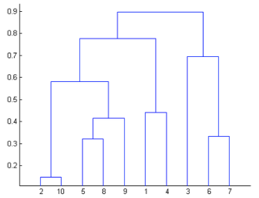
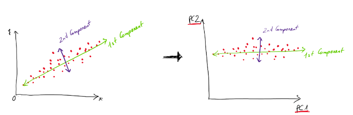

# #5. Unsupervised Learning Algorithms
Là một thuật toán phân tích (analyze) và phân cụm (cluster) các dữ liệu không được label. Thuật toán này khai thác các pattern ẩn hoặc gom cụm dữ liệu mà không cần sự can thiệp của con người. Từ các dữ liệu raw, dữ liệu không label, model tự phải dự đoán các quy tắc riêng, cấu trúc thông tin như: độ giống, khác nhau của dữ liệu và pattern mà không có sự hướng dẫn cách để làm việc với từng phần dữ liệu. 

Unsupervised learning phù hợp với các bài toán phải xử lý phức tạp, như gom lượng lớn dữ liệu thành một cụm. Nó hữu ích cho việc xác định các pattern không được phát hiện trước đó và có thể giúp xác định các features hữu ích cho việc phân loại.

Unsupervised learning thường có 3 nhiệm vụ chính:

* Clustering: Là một kỹ thuật khai phá dữ liệu, gom cụm dữ liệu dựa trên sự giống hoặc khác nhau. Thường được dùng để xử lý dữ liệu raw, các đối tượng không được phân loại thành các cụm biểu diễn bằng cấu trúc(structures) hoặc các mẫu patterns. Và có thể được phân chia thành các loại như: exclusive, overlapping (chồng chéo), hierachical(phân cấp) và probabilistic (xác suất).

    * Exclusive clustering là một loại phân cụm quy định một điểm dữ liệu (data point) chỉ nằm trong một cụm duy nhất. Một điển hình cho exclusive clustering là K-means clustering.
    * Overlapping clustering: Dữ liệu được nhóm vào theo hướng 1 data point có thể tồn tài trong 2 hoặc nhiều cluster với các góc độ khác nhau.
    * Hierachical clustering: Dữ liệu được vào một cluster riêng biệt dựa trên độ giống nhau, các cluster này được tổng hợp và tổ chức lại dựa trên một quan hệ phân tầng. Có 2 method chính cho hierachical clustering: agglomerative và divisive clustering.
    * Probabilistic clustering: Dữ liệu được nhóm vào 1 cluster dựa trên xác suất của từng data point của từng cụm.

* Association: Khai thác các mối liên kết dựa trên "rule" để khám phá các mối quan hệ giữa các data point trong một tập dữ liệu lớn. Thuật toán sẽ tìm kiếm các mối liên kết if-then để khám phá các mối tương quan (correlations) và tần suất (co-occurrences) trong dữ liệu và các kết nối khác nhau giữa các data objects. Thường được dùng để phân tích các giỏ bán hàng hoặc các giao dịch để thể hiện tần suất mua hàng của một số mặt hàng nhất định. Thuật toán này khám phá các purchasing patterns và các mối quan hệ ẩn sâu trong sản phẩm để giúp xây dựng hệ thống đề xuất. Ngoài ra có thể được dùng trong các tập dữ liệu về y tế và chẩn đoán lâm sàng.
* Dimensionality Reduction: Là một kỹ thuật giảm số lượng features hoặc dimensions trong dữ liệu. Vì nhiều dữ liệu thì có thể tốt nhưng để hiển thị sẽ là một thách thức lớn. Kỹ thuật này giúp extract các features quan trọng trong dữu liệu, giảm một số feature không thích đáng (irrelevant) hoặc ngẫu nhiên. Phương pháp này sử dụng principle component analysis (PCA) và singular value decomposition (SVD) để giảm số lượng data input mà vẫn đảm bảo được tính toàn vẹn của các thuộc tính trong dữ liệu gốc.


## K-means Clustering
Trong thuật toán k-Means, các data sẽ được chia thành K cụm. mỗi cụm dữ liệu được đặc trưng bởi một tâm (centroid). Tâm là điểm đại diện nhất cho một cụm và có giá trị bằng trung bình của toàn bộ các data point nằm trong cụm. Chúng ta sẽ dựa vào khoảng cách từ mỗi data point tới các tâm để xác định nhãn cho chúng thuộc về tâm gần nhất.
Giá trị K lớn sẽ biểu thị các cụm nhỏ hơn với độ chi tiết cao hơn, trong khi giá trị K nhỏ hơn sẽ có các cụm lớn hơn và độ chi tiết thấp hơn.

[KMeans OpenCV](https://scikit-learn.org/1.5/modules/generated/sklearn.cluster.KMeans.html)

Example:
``` title="k_means.py"
--8<-- "./code/k_means.py"
```

## Hierarchical Clustering
Với K-means clustering cần phải cấu hình trước số lượng cụm để phân chia. Nhưng Hierachical clustering không cần phải khai báo trước số lượng cụm, thay vào đó, thuật toán chỉ yêu cầu xác định trước thước đo về sự khác biệt giữa các cụm dựa trên sự khác biệt từng cặp giữa các data point trong 2 cụm.
### Agglomerative vs Divisive
* Agglomerative (chiến lược hợp nhất): Chiến lược này sẽ đi theo chiều bottom-up (từ dưới lên). Quá trình phân cụm bắt đầu ở dưới cùng tại các node lá (leaf node). Ban đầu các data point được xem là một cụm tách biệt được thể hiện bởi một leaf node. Ở mỗi level, ta cần tìm cách hợp một cặp cụm mới ở level cao hơn, cụm mới này tương ứng với các node quyết định (non-leaf node).
* Divisive (chiến lược phân chia): Chiến lược này sẽ thực hiện theo chiều top-down (từ trên xuống). Node gốc sẽ bao gồm tất các các data point, tại mỗi level sẽ phân chia các cụm đó thành 2 cụm mới, phép chia này sẽ tiến hành sao cho tạo thành 2 cụm mới có sự tách biệt (khoảng cách) giữa chúng là lớn nhất.

* Khoảng cách giữa 2 cụm: Khoảng cách giữa hai cụm chính là sự khác biệt giữa chúng. Một số phương pháp xác định khoảng cách giữa 2 cụm như:
    - Ward linkage
    - Single linkage
    - Complete linkage
    - Group average

* Các phương pháp xác định quá trình dừng phân cụm:
  * Xác định trước số lượng cụm cần phân chia ở tầng cao nhất. Ở đây tầng càng cao nếu như cụm càng xuất phát gần gốc nhất. Sau đó sẽ dừng thuật toán phân chia nếu như số lượng các cụm đạt được là chạm ngưỡng bằng k. Phương pháp lựa chọn k sẽ phù hợp nếu như ta biết trước dữ liệu có bao nhiêu cụm.
  * Thuật toán sẽ dừng nếu như việc gộp cụm tạo thành những cụm có độ gắn kết (cohension) thấp hơn. Độ gắn kết là một tiêu chuẩn để đo chất lượng cụm được tạo thành. Thông thường chúng ta có thể đo lường độ gắn kết dựa trên đường kính (diameter) của cụm sau gộp, đường kính được tính bằng khoảng cách lớn nhất giữa hai điểm trong cụm. Một cách khác đó là tính theo bán kính (radius) được xét bằng khoảng cách lớn nhất từ một điểm tới centroids hoặc clustroids của cụm.

### Dendrograms
Đồ thị của quá trình phân chia(divisive) hoặc hợp nhất(agglomerative) theo phân cấp còn được gọi là dendrogram, là một dạng cây quyết định nhị phân(binary decision tree).
<figure markdown>

  { width="300"}
  <figcaption>Dendrogram.</figcaption>

</figure>
Trục hoành thể hiện index của các data point trong nhóm được phân vào một cụm, trong khi tục tung là giá trị thước đo sự khác biệt giữa các cụm. Một cụm được đại diện bởi một node mà toàn bộ các data point khác nếu thuộc cụm thì đều liên kết tới node đó. Như vậy chúng ta có thể nhận thấy rằng các cụm có sự phân cấp dựa vào level của node. Khi kẻ một đường thẳng nằm ngang cắt toàn bộ các đường thẳng thẳng đứng ta sẽ thu được các cụm tương ứng với các node nằm gần nhất bên dưới đường thẳng.

Keyword: `scipy.cluster.hierarchy.dendrogram`

## Principal Component Analysis (PCA)
* PCA là một phương pháp giảm số chiều trong dữ liệu, được sử dụng để trích xuất các thông tin quan trọng nhất từ một tập dữ liệu đa chiều và biểu diễn chúng trong một không gian mới với số chiều thấp hơn. PCA dựa trên việc tìm các thành phần chính (principal components), tức là các vector riêng (eigenvectors) tương ứng với các giá trị riêng (eigenvalues) của ma trận hiệp phương sai (covariance matrix) của dữ liệu. Ví dụ dữ liệu của chính ta có N features thì sau khi áp dụng PCA sẽ còn K features chính mà thôi.
<figure markdown>

  { width="300"}
  <figcaption>PCA.</figcaption>

</figure>
Ví dụ như hình trên, chúng ta chọn 2 vector component theo thứ tự: 1st Comp sẽ có mức độ variance lớn nhất, ta chọn trước, sau đó đến 2nd Comp…. và cứ thế. Khi làm thực tế chúng ta sẽ cần xác định hoặc thử sai xem sẽ chọn bao nhiêu components là hợp lý và mang lại kết quả tốt nhất.

Lý do phải chọn component có mức độ dữ liệu biến thiên lớn là vì nếu chọn 1 component và chiếu lên đó các điểm dữ liệu không hight variance thì sẽ bị đè lên nhau và co cụm lại thì sẽ không thể phân loại được.

* Cách thức hoạt động:
1. Chuẩn hóa dữ liệu: Đảm bảo các đặc trưng có cùng thang đo (mean=0, variance =1)
2. Tính ma trận hiệp phương sai (covarience matrix): để biểu diễn sự tương quan giữa các đặc trưng.
3. Tính eigenvalues và eigenvectors: Eigenvectors là các hướng mới của không gian dữ liệu, eigenvalues cho biết độ quan trọng của các hướng đó.
4. Sắp xếp eigenvectors: Theo thứ tự eigenvalues giảm dần.
5. Chọn số chiều giảm: Chọn một số eigenvectors (tương ứng với các eigenvalues lớn nhất) để giữ lại nhiều thông tin nhất.
6. Chuyển đổi dữ liệu: Dự liệu ban đầu được chiếu vào không gian mới được xác định bởi các eigenvectors đã chọn.


* Ưu điểm của PCA:
1. PCA có thể giảm bớt đặc trưng dư thừa trong khi vẫn giữ lại phần lớn thông tin quan trọng.
2. Tăng hiệu suất tính toán: giảm thời gian tính toán, giảm thời gian training.
3. Giảm nhiễu: PCA loại bỏ các thành phần ít quan trọng và tập trung vào các thành phần chính, giảm nhiễu trong xử lý.
4. Dễ dàng visualize dữ liệu hơn để giúp ta có cái nhìn trực quan hơn.

* Nhược điểm của PCA:
1. Mất thông tin: Quá trình giảm số chiều có thể dẫn đến mất một phần thông tin quan trọng, đặc biệt nếu số chiều giữ lại quá thấp.
2. Khó giải thích: Các thành phần chính (principal components) là các tổ hợp tuyến tính của các biến gốc không có ý nghĩa rõ ràng về mặt vật lý hoặc thực tế.
3. Data Scaling : Phân tích thành phần chính nhạy cảm với quy mô của dữ liệu. Nếu dữ liệu không được chia tỷ lệ đúng cách, thì PCA có thể không hoạt động tốt.
4. Không hoạt động tốt với dữ liệu phi tuyến: PCA chỉ dựa trên tương quan tuyến tính, không phù hợp khi dữ liệu có mối quan hệ phi tuyến mạnh.
## Independent Component Analysis (ICA)

## T-Distributed Stochastic Neighbor Embedding (t-SNE)

# Ref

[What is unsupervised learning?](https://cloud.google.com/discover/what-is-unsupervised-learning?hl=en)

[Hierarchical Clustering](https://phamdinhkhanh.github.io/deepai-book/ch_ml/index_HierarchicalClustering.html)

[PCA](https://www.miai.vn/2021/04/22/principal-component-analysis-pca-tuyet-chieu-giam-chieu-du-lieu/)
